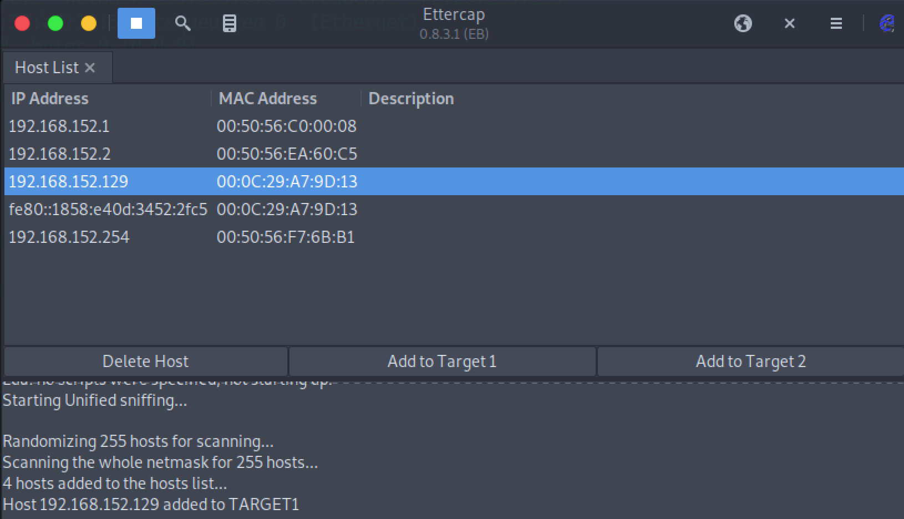
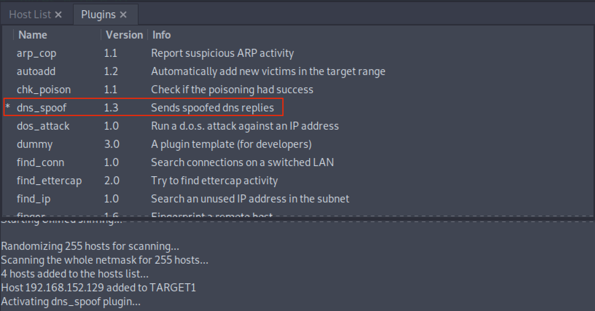
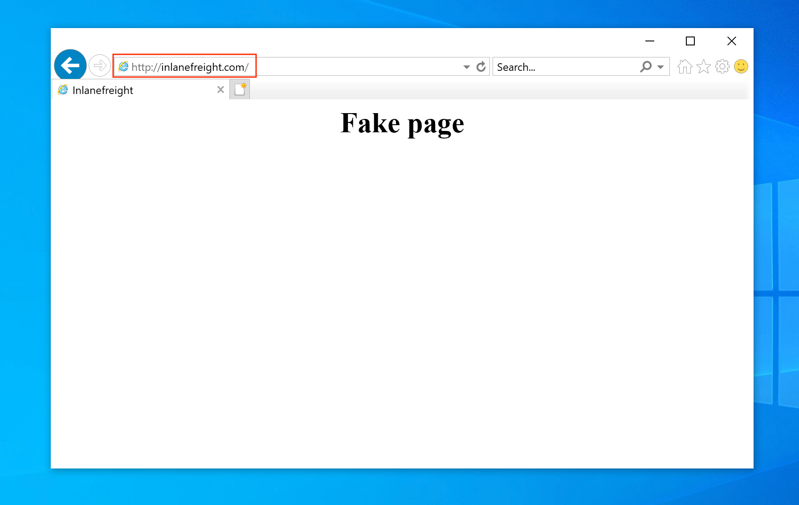

The [Domain Name System](https://www.cloudflare.com/learning/dns/what-is-dns/) (`DNS`) translates domain names (e.g., hackthebox.com) to the numerical IP addresses (e.g., 104.17.42.72). DNS is mostly `UDP/53`, but DNS will rely on `TCP/53` more heavily as time progresses. DNS has always been designed to use both UDP and TCP port 53 from the start, with UDP being the default, and falls back to using TCP when it cannot communicate on UDP, typically when the packet size is too large to push through in a single UDP packet.

### Enumeration

```bash
nmap -p53 -Pn -sV -sC <ip-address>
```

### DNS Zone Transfer

#### DIG - AXFR Zone Transfer

```bash
dig AXFR @ns1.inlanefreight.htb inlanefreight.htb
```

Tools like [Fierce](https://github.com/mschwager/fierce) can also be used to enumerate all DNS servers of the root domain and scan for a DNS zone transfer:

```bash
fierce --domain zonetransfer.me

NS: nsztm2.digi.ninja. nsztm1.digi.ninja.
SOA: nsztm1.digi.ninja. (81.4.108.41)
Zone: success
{<DNS name @>: '@ 7200 IN SOA nsztm1.digi.ninja. robin.digi.ninja. 2019100801 '
               '172800 900 1209600 3600\n'
               '@ 300 IN HINFO "Casio fx-700G" "Windows XP"\n'
               '@ 301 IN TXT '
               '"google-site-verification=tyP28J7JAUHA9fw2sHXMgcCC0I6XBmmoVi04VlMewxA"\n'
               '@ 7200 IN MX 0 ASPMX.L.GOOGLE.COM.\n'
               '@ 7200 IN MX 10 ALT1.ASPMX.L.GOOGLE.COM.\n'
               '@ 7200 IN MX 10 ALT2.ASPMX.L.GOOGLE.COM.\n'
               '@ 7200 IN MX 20 ASPMX2.GOOGLEMAIL.COM.\n'
               '@ 7200 IN MX 20 ASPMX3.GOOGLEMAIL.COM.\n'
               '@ 7200 IN MX 20 ASPMX4.GOOGLEMAIL.COM.\n'
               '@ 7200 IN MX 20 ASPMX5.GOOGLEMAIL.COM.\n'
               '@ 7200 IN A 5.196.105.14\n'
               '@ 7200 IN NS nsztm1.digi.ninja.\n'
               '@ 7200 IN NS nsztm2.digi.ninja.',
 <DNS name _acme-challenge>: '_acme-challenge 301 IN TXT '
                             '"6Oa05hbUJ9xSsvYy7pApQvwCUSSGgxvrbdizjePEsZI"',
 <DNS name _sip._tcp>: '_sip._tcp 14000 IN SRV 0 0 5060 www',
 <DNS name 14.105.196.5.IN-ADDR.ARPA>: '14.105.196.5.IN-ADDR.ARPA 7200 IN PTR '
                                       'www',
 <DNS name asfdbauthdns>: 'asfdbauthdns 7900 IN AFSDB 1 asfdbbox',
 <DNS name asfdbbox>: 'asfdbbox 7200 IN A 127.0.0.1',
 <DNS name asfdbvolume>: 'asfdbvolume 7800 IN AFSDB 1 asfdbbox',
 <DNS name canberra-office>: 'canberra-office 7200 IN A 202.14.81.230',
 <DNS name cmdexec>: 'cmdexec 300 IN TXT "; ls"',
 <DNS name contact>: 'contact 2592000 IN TXT "Remember to call or email Pippa '
                     'on +44 123 4567890 or pippa@zonetransfer.me when making '
                     'DNS changes"',
 <DNS name dc-office>: 'dc-office 7200 IN A 143.228.181.132',
 <DNS name deadbeef>: 'deadbeef 7201 IN AAAA dead:beaf::',
 <DNS name dr>: 'dr 300 IN LOC 53 20 56.558 N 1 38 33.526 W 0.00m',
 <DNS name DZC>: 'DZC 7200 IN TXT "AbCdEfG"',
 <DNS name email>: 'email 2222 IN NAPTR 1 1 "P" "E2U+email" "" '
                   'email.zonetransfer.me\n'
                   'email 7200 IN A 74.125.206.26',
 <DNS name Hello>: 'Hello 7200 IN TXT "Hi to Josh and all his class"',
 <DNS name home>: 'home 7200 IN A 127.0.0.1',
 <DNS name Info>: 'Info 7200 IN TXT "ZoneTransfer.me service provided by Robin '
                  'Wood - robin@digi.ninja. See '
                  'http://digi.ninja/projects/zonetransferme.php for more '
                  'information."',
 <DNS name internal>: 'internal 300 IN NS intns1\ninternal 300 IN NS intns2',
 <DNS name intns1>: 'intns1 300 IN A 81.4.108.41',
 <DNS name intns2>: 'intns2 300 IN A 167.88.42.94',
 <DNS name office>: 'office 7200 IN A 4.23.39.254',
 <DNS name ipv6actnow.org>: 'ipv6actnow.org 7200 IN AAAA '
                            '2001:67c:2e8:11::c100:1332',
...SNIP...
```

### Domain Takeovers & Subdomain Enumeration

`Domain takeover` is registering a non-existent domain name to gain control over another domain. If attackers find an expired domain, they can claim that domain to perform further attacks such as hosting malicious content on a website or sending a phishing email leveraging the claimed domain.

Domain takeover is also possible with subdomains called `subdomain takeover`. 

#### Subdomain Enumeration

##### Subfinder

```bash
./subfinder -d inlanefreight.com -v       
                                                                       
        _     __ _         _                                           
____  _| |__ / _(_)_ _  __| |___ _ _          
(_-< || | '_ \  _| | ' \/ _  / -_) '_|                 
/__/\_,_|_.__/_| |_|_||_\__,_\___|_| v2.4.5                                                                                                                                                                                                                                                 
                projectdiscovery.io                    
                                                                       
[WRN] Use with caution. You are responsible for your actions
[WRN] Developers assume no liability and are not responsible for any misuse or damage.
[WRN] By using subfinder, you also agree to the terms of the APIs used. 
                                   
[INF] Enumerating subdomains for inlanefreight.com
[alienvault] www.inlanefreight.com
[dnsdumpster] ns1.inlanefreight.com
[dnsdumpster] ns2.inlanefreight.com
...snip...
[bufferover] Source took 2.193235338s for enumeration
ns2.inlanefreight.com
www.inlanefreight.com
ns1.inlanefreight.com
support.inlanefreight.com
[INF] Found 4 subdomains for inlanefreight.com in 20 seconds 11 milliseconds
```

##### Subbrute

An excellent alternative is a tool called [Subbrute](https://github.com/TheRook/subbrute). This tool allows us to use self-defined resolvers and perform pure DNS brute-forcing attacks during internal penetration tests on hosts that do not have Internet access.

```bash
git clone https://github.com/TheRook/subbrute.git >> /dev/null 2>&1
cd subbrute
echo "ns1.inlanefreight.com" > ./resolvers.txt
./subbrute.py inlanefreight.com -s ./names.txt -r ./resolvers.txt

Warning: Fewer than 16 resolvers per process, consider adding more nameservers to resolvers.txt.
inlanefreight.com
ns2.inlanefreight.com
www.inlanefreight.com
ms1.inlanefreight.com
support.inlanefreight.com

<SNIP>
```

The [can-i-take-over-xyz](https://github.com/EdOverflow/can-i-take-over-xyz) repository is also an excellent reference for a subdomain takeover vulnerability. It shows whether the target services are vulnerable to a subdomain takeover and provides guidelines on assessing the vulnerability.

### DNS Spoofing

DNS spoofing is also referred to as `DNS Cache Poisoning`. This attack involves altering legitimate DNS records with false information so that they can be used to redirect online traffic to a fraudulent website. Example attack paths for the DNS Cache Poisoning are as follows:

* An attacker could intercept the communication between a user and a DNS server to route the user to a fraudulent destination instead of a legitimate 	one by performing a Man-in-the-Middle (`MITM`) attack.

* Exploiting a vulnerability found in a DNS server could yield control over the server by an attacker to modify the DNS records.

#### Local DNS Cache Poisoning

From a local network perspective, an attacker can also perform DNS Cache Poisoning using MITM tools like [Ettercap](https://www.ettercap-project.org/) or [Bettercap](https://www.bettercap.org/).

```bash
cat /etc/ettercap/etter.dns

inlanefreight.com      A   192.168.225.110
*.inlanefreight.com    A   192.168.225.110
```

Next, start the `Ettercap` tool and scan for live hosts within the network by navigating to `Hosts > Scan for Hosts`. Once completed, add the target IP address (e.g., `192.168.152.129`) to Target1 and add a default gateway IP (e.g., `192.168.152.2`) to Target2.



Activate `dns_spoof` attack by navigating to `Plugins > Manage Plugins`. This sends the target machine with fake DNS responses that will resolve `inlanefreight.com` to IP address `192.168.225.110`:



After a successful DNS spoof attack, if a victim user coming from the target machine `192.168.152.129` visits the `inlanefreight.com` domain on a web browser, they will be redirected to a Fake page that is hosted on IP address `192.168.225.110`:



In addition, a ping coming from the target IP address `192.168.152.129` to `inlanefreight.com` should be resolved to `192.168.225.110` as well:

```bash
C:\>ping inlanefreight.com

Pinging inlanefreight.com [192.168.225.110] with 32 bytes of data:
Reply from 192.168.225.110: bytes=32 time<1ms TTL=64
Reply from 192.168.225.110: bytes=32 time<1ms TTL=64
Reply from 192.168.225.110: bytes=32 time<1ms TTL=64
Reply from 192.168.225.110: bytes=32 time<1ms TTL=64

Ping statistics for 192.168.225.110:
    Packets: Sent = 4, Received = 4, Lost = 0 (0% loss),
Approximate round trip times in milli-seconds:
    Minimum = 0ms, Maximum = 0ms, Average = 0ms
```

