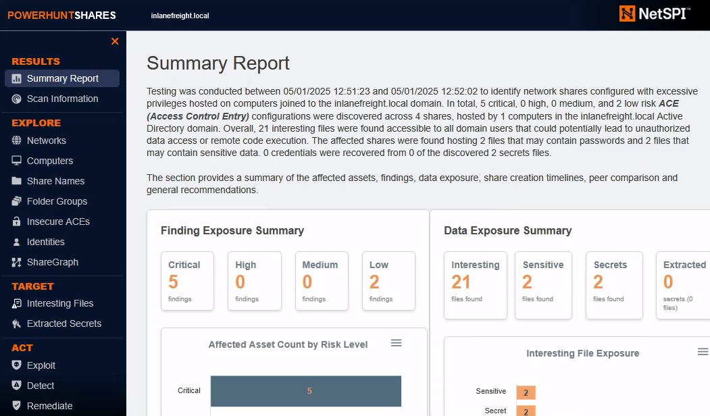

## Credential Hunting in Network Traffic

### Wireshark

| Wireshark filter                                | Description                                                                 |
|-------------------------------------------------|-----------------------------------------------------------------------------|
| ip.addr == 56.48.210.13                         | Filters packets with a specific IP address.                                 |
| tcp.port == 80                                  | Filters packets by port (HTTP in this case).                                |
| http                                            | Filters for HTTP traffic.                                                   |
| dns                                             | Filters DNS traffic, useful to monitor domain name resolution.              |
| tcp.flags.syn == 1 && tcp.flags.ack == 0        | Filters SYN packets (used in TCP handshakes), useful for detecting scans or connection attempts. |
| icmp                                            | Filters ICMP packets (Ping), useful for reconnaissance or network issues.   |
| http.request.method == "POST"                   | Filters HTTP POST requests. Over unencrypted HTTP this may expose passwords or other sensitive info. |
| tcp.stream eq 53                                | Filters a specific TCP stream, helpful to track a conversation between two hosts. |
| eth.addr == 00:11:22:33:44:55                   | Filters packets from/to a specific MAC address.                             |
| ip.src == 192.168.24.3 && ip.dst == 56.48.210.3 | Filters traffic between two specific IPs, helps track communication between hosts. |

### Pcredz

[Pcredz](https://github.com/lgandx/PCredz) is a tool that can be used to extract credentials from live traffic or network packet captures. Specifically, it supports extracting the following information:

* Credit card numbers
* POP credentials
* SMTP credentials
* IMAP credentials
* SNMP community strings
* FTP credentials
* Credentials from HTTP NTLM/Basic headers, as well as HTTP Forms
* NTLMv1/v2 hashes from various traffic including DCE-RPC, SMBv1/2, LDAP, MSSQL, and HTTP
* Kerberos (AS-REQ Pre-Auth etype 23) hashes

```bash
./Pcredz -f demo.pcapng -t -v
```

## Credential Hunting in Network Shares

### Hunting from Windows

#### Snaffler

The first tool we will cover is [Snaffler](https://github.com/SnaffCon/Snaffler). This is a C# program that, when run on a `domain-joined` machine, automatically identifies accessible network shares and searches for interesting files.

```bash
c:\Users\Public>Snaffler.exe -s
```

#### PowerHuntShares

Another tool that can be used is [PowerHuntShares](https://github.com/NetSPI/PowerHuntShares), a PowerShell script that doesn't necessarily need to be run on a domain-joined machine. 



We can run a basic scan using `PowerHuntShares` like so:

```bash
PS C:\Users\Public\PowerHuntShares> Invoke-HuntSMBShares -Threads 100 -OutputDirectory c:\Users\Public
```

### Hunting from Linux

#### MANSPIDER

If we don’t have access to a domain-joined computer, or simply prefer to search for files remotely, tools like [MANSPIDER](https://github.com/blacklanternsecurity/MANSPIDER) allow us to scan SMB shares from Linux.

```bash
./manspider.py --threads 256 10.129.180.240 -u mendres -p Inlanefreight2025! -c passwd login creds password
```

#### NetExec

[Official Wiki](https://www.netexec.wiki/smb-protocol/spidering-shares)

```bash
nxc smb 10.129.234.121 -u mendres -p 'Inlanefreight2025!' --spider IT --content --pattern "passw"
```


