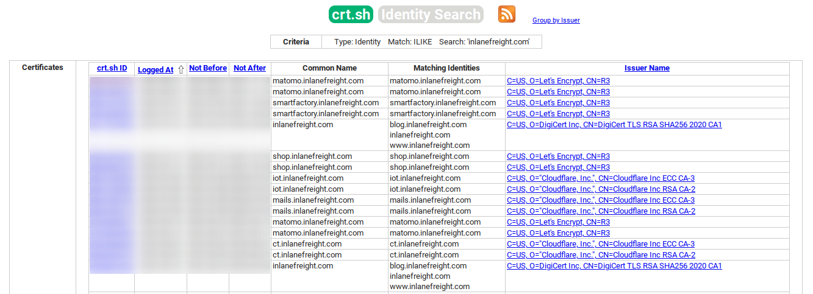

---

The first point of presence on the Internet may be the SSL certificate from the company's main website that we can examine.


### Subdomain Enumeration using certificate

[crt.sh](https://crt.sh/)



### Certificate Transparency

`curl -s https://crt.sh/\?q\=<domain>\&output\=json | jq .`

`curl -s https://crt.sh/\?q\=<domain>\&output\=json | jq . | grep name | cut -d":" -f2 | grep -v "CN=" | cut -d'"' -f2 | awk '{gsub(/\\n/,"\n");}1;' | sort -u`

### Company Hosted Servers

`for i in $(cat subdomainlist);do host $i | grep "has address" | grep inlanefreight.com | cut -d" " -f1,4;done`

### Shodan - IP List

```bash
for i in $(cat subdomainlist);do host $i | grep "has address" | grep inlanefreight.com | cut -d" " -f4 >> ip-addresses.txt;done

for i in $(cat ip-addresses.txt);do shodan host $i;done
```


### DNS Records

`dig any <domain>`


