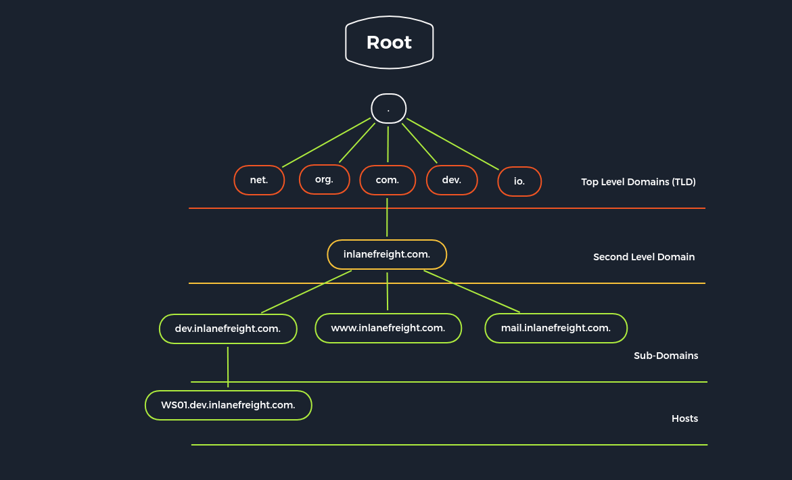

---

### Cheat sheet

Here's your DNS enumeration table converted into Markdown:

```markdown
| Command                                                                                                                                                                                                                                     | Description                                                        |
|---------------------------------------------------------------------------------------------------------------------------------------------------------------------------------------------------------------------------------------------|--------------------------------------------------------------------|
| `sudo nmap -sU -sV -p53 <target>`                                                                                                                                                                                                           | Service detection (UDP-based)                                      |
| `dig ns <domain> @<dns-server>`                                                                                                                                                                                                             | DIG-NS Query                                                       |
| `dig CH TXT version.bind <dns-server>`                                                                                                                                                                                                      | DIG-VERSION Query                                                  |
| `dig any @<dns-server> <domain>`                                                                                                                                                                                                            | Get all available records                                          |
| `dig axfr @<dns-server> <domain>`                                                                                                                                                                                                           | DIG-AXFR Query / Attempt zone transfer (AXFR)                      |
| `dig @<dns-server> <domain>`                                                                                                                                                                                                                | Standard DNS query                                                 |
| `host <domain> <dns-server>`                                                                                                                                                                                                                | DNS lookup using host                                              |
| `nslookup <domain> <dns-server>`                                                                                                                                                                                                            | Manual DNS resolution                                              |
| `dnsrecon -d <domain> -a`                                                                                                                                                                                                                   | Full recon (zone transfer, subdomain bruteforce, cache snoop)      |
| `dnsenum <domain>`                                                                                                                                                                                                                          | DNS enumeration + bruteforce                                       |
| `fierce --domain <domain>`                                                                                                                                                                                                                  | Subdomain brute-forcing                                            |
| `dig -x <IP>`                                                                                                                                                                                                                               | Reverse DNS lookup                                                 |
| `dig +short txt <domain>`                                                                                                                                                                                                                   | Grab TXT records (SPF, DMARC)                                      |
| `whois <domain>`                                                                                                                                                                                                                            | Domain WHOIS info                                                  |
| `dig soa <domain>`                                                                                                                                                                                                                          | DNS Zone Information                                               |
| `for sub in $(cat /opt/useful/seclists/Discovery/DNS/subdomains-top1million-110000.txt); do dig $sub.<domain> @<dns-server> | grep -v ';\|SOA' | sed -r '/^\s*$/d' | grep $sub | tee -a subdomains.txt; done`                               | Subdomain Enumeration (manual loop)                                |
| `dnsenum --dnsserver <dns-server> --enum -p 0 -s 0 -o subdomains.txt -f /opt/useful/seclists/Discovery/DNS/subdomains-top1million-110000.txt <domain>`                                                                                      | Subdomain Enumeration via DNSenum                                  |
```

### NSE Scripts

`find / -type f -name dns* 2>/dev/null | grep scripts`

```/usr/share/nmap/scripts/dns-zone-transfer.nse  
/usr/share/nmap/scripts/dns-nsid.nse  
/usr/share/nmap/scripts/dns-brute.nse  
/usr/share/nmap/scripts/dns-cache-snoop.nse  
/usr/share/nmap/scripts/dns-service-discovery.nse  
/usr/share/nmap/scripts/dns-recursion.nse  
/usr/share/nmap/scripts/dns-resolve.nse  
/usr/share/nmap/scripts/dns-random-txid.nse  
/usr/share/nmap/scripts/dns-random-srcport.nse
```

### Resources

[Bind9](https://www.isc.org/bind/)<br>
[DNSEnum](https://github.com/fwaeytens/dnsenum)


**DNS (Domain Name System)** is a protocol for resolving human-readable domain names (like google.com) to IP addresses. It operates mainly over UDP port 53, but
sometimes TCP 53 (e.g., for zone transfers).

• It's like the phonebook of the internet.<br>
• Misconfigured DNS can reveal internal infrastructure, subdomains, and allow zone transfers.<br>
• DNS-based attacks include cache poisoning, spoofing, zone transfer leaks, and exfiltration via DNS tunneling.<br>

| Type   | Description                         |
|--------|-------------------------------------|
| `A`    | IPv4 address                        |
| `AAAA` | IPv6 address                        |
| `CNAME`| Canonical name (alias)              |
| `MX`   | Mail server                         |
| `NS`   | Nameserver                          |
| `TXT`  | Text records (SPF, DMARC, etc.)     |
| `PTR`  | Reverse lookup record               |
| `SOA`  | Start of Authority (zone config)    |
| `SRV`  | Service location                    |




| Server Type               | Description                                                                                                                                                                                                                                                                       |
|---------------------------|-----------------------------------------------------------------------------------------------------------------------------------------------------------------------------------------------------------------------------------------------------------------------------------|
| `DNS Root Server`         | Responsible for top-level domains (TLDs). Queried only if no other name server responds. Acts as the backbone of DNS resolution, linking domain names to IPs. Managed by ICANN, with 13 root servers distributed globally.                                                        |
| `Authoritative Nameserver`| Holds authority over a DNS zone. Answers queries only within its zone. If it can't answer, the query escalates to the root server. Returns definitive answers to recursive resolvers based on organization, region, or domain.                                                  |
| `Non-authoritative Nameserver` | Doesn’t own a DNS zone. Instead, it gathers answers from authoritative sources using recursive or iterative queries.                                                                                                                |
| `Caching DNS Server`      | Stores DNS responses from other servers temporarily, based on TTL set by authoritative servers. Reduces lookup time and traffic.                                                                                                                                                |
| `Forwarding Server`       | Simply forwards DNS queries to another designated DNS server. Often used to control or monitor outbound DNS traffic.                                                                                                                       |
| `Resolver`                | Typically local (on your device or router), performs the initial DNS query and forwards it if it can’t answer from cache.                                                                                                                  |


