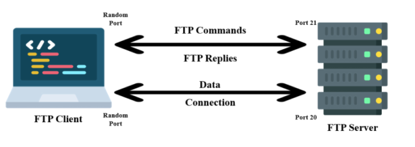

---

### Cheat sheet 

| Command                                                                                                     | Description                          |
|-------------------------------------------------------------------------------------------------------------|--------------------------------------|
| `sudo nmap -sC -sV -p21 -A <ftp-server>`                                                                    | FTP service and version detection    |
| `nmap --script ftp-anon -p21 <ftp-server>`                                                                  | Check for anonymous login            |
| `nmap --script ftp-brute -p21 <ftp-server>`                                                                 | Brute-force FTP credentials          |
| `sudo nmap -sV -p21 <ftp-server> --script banner`                                                           | FTP server banner grabbing           |
| `hydra -l <user> -P <wordlist> ftp://<ftp-server>`                                                          | Brute-force login using Hydra        |
| `nc -nv <ftp-server> 21`                                                                                    | Banner grab using netcat             |
| `telnet <ftp-server> 21`                                                                                    | Banner grab using telnet             |
| `python3 -c "from ftplib import FTP; f=FTP('<target>'); f.login(); print(f.nlst())"`                        | Quick anonymous login check          |
| `openssl s_client -connect <ftp-server>:21 -starttls ftp`                                                   | Test FTP with STARTTLS using OpenSSL |


### NSE Scripts

`find / -type f -name ftp* 2>/dev/null | grep scripts`

```/usr/share/nmap/scripts/ftp-syst.nse
/usr/share/nmap/scripts/ftp-vsftpd-backdoor.nse
/usr/share/nmap/scripts/ftp-vuln-cve2010-4221.nse
/usr/share/nmap/scripts/ftp-proftpd-backdoor.nse
/usr/share/nmap/scripts/ftp-bounce.nse
/usr/share/nmap/scripts/ftp-libopie.nse
/usr/share/nmap/scripts/ftp-anon.nse
/usr/share/nmap/scripts/ftp-brute.nse
```

### Resources 

[FTP Command List](https://web.archive.org/web/20230326204635/https://www.smartfile.com/blog/the-ultimate-ftp-commands-list/)<br>
[Status Codes](https://en.wikipedia.org/wiki/List_of_FTP_server_return_codes)

**FTP (File Transfer Protocol)** is a standard network protocol used to transfer files between a client and a server over TCP port 21. 

FTP is a clear-text protocol. 

It supports user authentication but transmits data and credentials in plaintext by default. The FTP runs within the application layer of the TCP/IP protocol stack. 

Anonymous Login - 

`ftp <ftp-server> 21`<br>
anonymous:anonymous

| Command                                                                                      | Description            |
|----------------------------------------------------------------------------------------------|------------------------|
| `ls -R`                                                                                      | Recursive listing      |
| `get <file>`                                                                                 | Download a file        |
| `wget -m --no-passive ftp://anonymous:anonymous@<ftp server>`                                | Download all files     |
| `put <file>`                                                                                 | Upload a file          |


