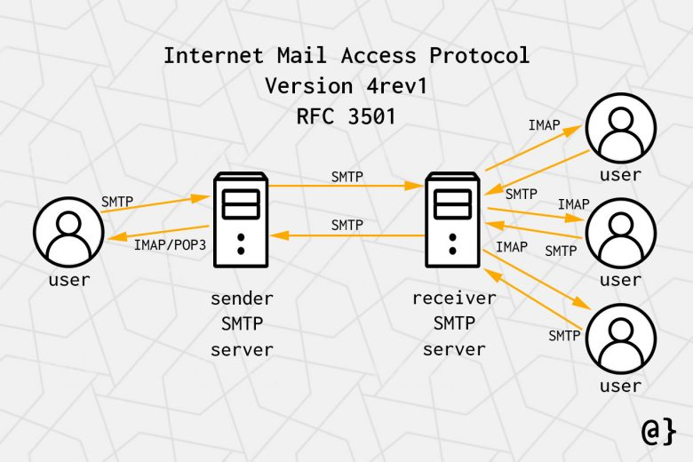

---

### Cheat sheet

### IMAP Enumeration Cheatsheet

| Commands                                                                                                              | Description                                                    |
|-----------------------------------------------------------------------------------------------------------------------|----------------------------------------------------------------|
| `sudo nmap -sV -p143,993 <target>`                                                                                   | Detect IMAP service and version                                |
| `openssl s_client -connect <target>:993`                                                                             | Connect to IMAP over SSL (port 993)                            |
| `openssl s_client -starttls imap -connect <target>:143`                                                              | Upgrade plaintext IMAP to TLS using STARTTLS                   |
| `telnet <target> 143`                                                                                                | Manual interaction over plaintext IMAP                         |
| `nc <target> 143`                                                                                                    | Netcat to connect for manual IMAP testing                      |
| `curl -u user:pass imaps://<target>/ -k`                                                                             | Use curl to test login to IMAP                                 |
| `swaks --server <target> --auth-user <user> --auth-password <pass> --protocol imap`                                 | Use swaks for login tests                                      |
| `python3 imap_brute.py <target> <userlist> <passlist>`                                                               | Custom brute-force script (if needed)                          |

### NSE Scripts

`find / -type f -name imap* 2>/dev/null | grep scripts`

```/usr/share/nmap/scripts/imap-capabilities.nse  
/usr/share/nmap/scripts/imap-brute.nse  
/usr/share/nmap/scripts/imap-ntlm-info.nse
```

**IMAP (Internet Message Access Protocol)** is used by mail clients to retrieve and manage emails stored on a mail server. Unlike POP3, it leaves messages on the server and 
supports folders, flags, and concurrent access.

• Port 143: IMAP (plaintext or STARTTLS)<br>
• Port 993: IMAPS (implicit SSL)

### IMAP Commands Reference

| Command                                      | Description                                                                                           |
|----------------------------------------------|-------------------------------------------------------------------------------------------------------|
| `1 LOGIN username password`                  | User's login                                                                                          |
| `1 LIST "" *`                                | Lists all directories                                                                                 |
| `1 CREATE "INBOX"`                           | Creates a mailbox with a specified name                                                               |
| `1 DELETE "INBOX"`                           | Deletes a mailbox                                                                                     |
| `1 RENAME "ToRead" "Important"`              | Renames a mailbox                                                                                     |
| `1 LSUB "" *`                                | Returns subscribed mailboxes                                                                          |
| `1 SELECT INBOX`                             | Selects a mailbox to access its messages                                                              |
| `1 UNSELECT INBOX`                           | Exits the selected mailbox                                                                            |
| `1 FETCH <ID> all`                           | Retrieves data from a message                                                                         |
| `1 CLOSE`                                    | Deletes messages flagged as `Deleted` from the selected mailbox                                       |
| `1 LOGOUT`                                   | Closes the connection with the IMAP server                                                            |




