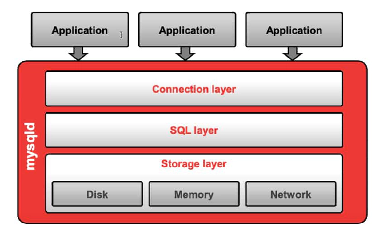

---

### Cheat sheet 

| Command                                                                                   | Description                                 |
|-------------------------------------------------------------------------------------------|---------------------------------------------|
| `sudo nmap -sC -sV -p3306 <target>`                                                       | Basic service & version detection           |
| `sudo nmap -sV -p3306 --script=mysql-info <target>`                                       | Identify MySQL version & config             |
| `nmap -p3306 --script=mysql-users,mysql-empty-password,mysql-brute <target>`              | Brute-force and weak creds check            |
| `mysql -h <target> -u root -p`                                                            | Connect to MySQL, prompt for password       |
| `mysql -h <target> -u root -e "SHOW DATABASES;" -p`                                       | Show all databases                          |
| `mysql -h <target> -u root -e "SELECT user,host FROM mysql.user;" -p`                     | List users and their allowed hosts          |
| `mysqladmin -h <target> -u root -p version`                                               | Get version and status info                 |
| `hydra -L users.txt -P passwords.txt -f -e ns -vV -s 3306 <target> mysql`                 | Brute-force MySQL login using Hydra         |
| `metasploit > use auxiliary/scanner/mysql/mysql_login`                                    | Metasploit module for brute-forcing MySQL   |

### NSE Scripts

`find / -type f -name mysql* 2>/dev/null | grep scripts`

```/usr/share/nmap/scripts/mysql-info.nse  
/usr/share/nmap/scripts/mysql-users.nse  
/usr/share/nmap/scripts/mysql-empty-password.nse  
/usr/share/nmap/scripts/mysql-brute.nse  
/usr/share/nmap/scripts/mysql-databases.nse  
/usr/share/nmap/scripts/mysql-query.nse  
/usr/share/nmap/scripts/mysql-variables.nse
```


**MySQL** is a widely-used open-source relational database. It uses TCP port 3306 by default.
When exposed to the network and misconfigured (e.g., empty password, remote root access), it becomes a goldmine during internal pentests or misconfigured cloud setups.

| Command                                                                                  | Description                                                                             |
|------------------------------------------------------------------------------------------|-----------------------------------------------------------------------------------------|
| `mysql -u <user> -p<password> -h <IP address>`                                           | Connect to the MySQL server (no space between `-p` and password)                       |
| `show databases;`                                                                        | Show all databases                                                                     |
| `use <database>;`                                                                        | Select an existing database                                                            |
| `show tables;`                                                                           | List all tables in the selected database                                               |
| `show columns from <table>;`                                                             | Show all columns in the selected table                                                 |
| `select * from <table>;`                                                                 | Display all rows and columns from a table                                              |
| `select * from <table> where <column> = "<string>";`                                     | Search for a specific value in a column                                                |

