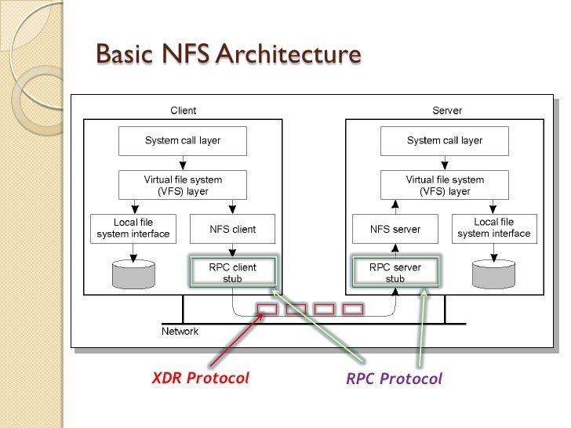

---

### Cheat sheet

| Command                                                                                                  | Description                                      |
|----------------------------------------------------------------------------------------------------------|--------------------------------------------------|
| `sudo nmap -sC -sV -p111,2049 <nfs-server>`                                                              | Detect NFS service and version                   |
| `showmount -e <nfs-server>`                                                                              | List exported NFS shares                         |
| `showmount -a <nfs-server>`                                                                              | List all clients and mounted shares              |
| `sudo mkdir -p /mnt/nfs && sudo mount -t nfs <nfs-server>:/<share> /mnt/nfs`                             | Mount NFS share locally                          |
| `sudo mount -o nolock <nfs-server>:/<share> /mnt/nfs`                                                    | Mount when portmapper is blocked                 |
| `nmap --script nfs-ls,nfs-statfs,nfs-showmount -p2049 <nfs-server>`                                      | Use Nmap NSE for detailed enumeration            |
| `cat /etc/exports`                                                                                       | On server side, list shared folders              |
| `exportfs -v`                                                                                            | Show exported shares (verbose) on server         |
| `umount /mnt/nfs`                                                                                        | Unmount share from system                        |
| `nfspy /mnt/nfs`                                                                                         | Try to gain write access without root privileges |
| `python3 /opt/impacket/examples/nfsexport.py <nfs-server>`                                               | Impacket script to enumerate exports             |


### NSE Scripts

`find / -type f -name nfs* 2>/dev/null | grep scripts`

```/usr/share/nmap/scripts/nfs-ls.nse  
/usr/share/nmap/scripts/nfs-statfs.nse  
/usr/share/nmap/scripts/nfs-showmount.nse  
```


**NFS (Network File System)** is a distributed file system protocol allowing users to access files over a network similar to local storage. It commonly runs on TCP and UDP 
port 2049.

• Clients can mount NFS shares and interact with files remotely.<br>
• Older versions of NFS (v2/v3) don't use encryption or authentication by default.<br>
• Access control is IP-based and uses UID/GID mapping for permissions.<br>

NFS is based on the [Open Network Computing Remote Procedure Call](https://en.wikipedia.org/wiki/Sun_RPC) (ONC-RPC/SUN-RPC) protocol exposed on TCP and UDP ports 111, which uses [External Data Representation](https://en.wikipedia.org/wiki/External_Data_Representation) (XDR) for the system-independent exchange of data.

