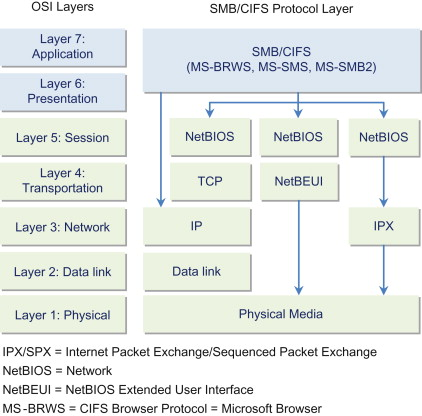

---

### Cheat sheet

| Command                                                                                                                              | Description                                      |
|--------------------------------------------------------------------------------------------------------------------------------------|--------------------------------------------------|
| `sudo nmap -sC -sV -p139,445 <smb-server>`                                                                                            | SMB service and version detection               |
| `nmap --script smb-os-discovery -p139,445 <smb-server>`                                                                              | Discover OS info via SMB                        |
| `nmap --script smb-enum-shares -p139,445 <smb-server>`                                                                               | Enumerate shared folders                        |
| `nmap --script smb-enum-users -p139,445 <smb-server>`                                                                                | Enumerate users via SMB                         |
| `nmap --script smb-vuln* -p139,445 <smb-server>`                                                                                     | Check for SMB vulnerabilities                   |
| `nmap --script smb-protocols -p139,445 <smb-server>`                                                                                 | Check SMB protocol versions (v1/v2/v3)          |
| `nmap --script smb-security-mode -p139,445 <smb-server>`                                                                             | Check SMB signing/encryption settings           |
| `smbclient -L //<smb-server>/ -N`                                                                                                     | List shares anonymously                         |
| `smbclient //<smb-server>/<share> -U`                                                                                                 | Access SMB share                                |
| `smbclient //<smb-server>/<share> -U anonymous%anonymous`                                                                             | Try anonymous login                             |
| `rpcclient -U "" <smb-server>`                                                                                                       | Null session login                              |
| `enum4linux-ng -A <smb-server>`                                                                                                      | Full SMB and RPC enumeration                    |
| `crackmapexec smb <smb-server> -u <user> -p <pass>`                                                                                   | Test login credentials                          |
| `crackmapexec smb <smb-server> --shares -u '' -p ''`                                                                                  | List shares (anonymous or with credentials)     |
| `crackmapexec smb <smb-server> --users`                                                                                              | Enumerate users (RPC bind)                      |
| `crackmapexec smb <smb-server> --gen-relay-list smb_targets.txt`                                                                     | Generate SMB relay targets                      |
| `nbtscan <smb-server>`                                                                                                               | Scan NetBIOS info                               |
| `nmblookup -A <smb-server>`                                                                                                          | Get NetBIOS name and info                       |
| `smbmap -H <smb-server>`                                                                                                             | List accessible shares                          |
| `smbmap -H <smb-server> -u <user> -p <pass>`                                                                                          | Authenticated share access                      |
| `python3 /usr/share/doc/python3-impacket/examples/smbclient.py <smb-server> -username <user> -password <pass>`                       | Access SMB share using Impacket                 |
| `smbstatus`                                                                                                                          | Check Samba status                              |
| `python3 /usr/share/doc/python3-impacket/examples/samrdump.py`                                                                       | Enumerate SMB shares                            |

#### RPC Client

| Command                                                                                       | Description                                       |
|-----------------------------------------------------------------------------------------------|---------------------------------------------------|
| `srvinfo`                                                                                     | Server information                                |
| `enumdomains`                                                                                 | Enumerate all deployed domains                    |
| `querydominfo`                                                                                | Domain/server/user info of deployed domains       |
| `netshareenumall`                                                                             | Enumerates all available shares                   |
| `netsharegetinfo <share>`                                                                     | Info about a specific share                       |
| `enumdomusers`                                                                                | Enumerates all domain users                       |
| `queryuser <RID>`                                                                             | Info about a specific user                        |
| `querygroup <group_RID>`                                                                      | Info about a specific group                       |
| `for i in $(seq 500 1100); do rpcclient -N -U "" <smb-server> -c "queryuser 0x$(printf '%x\n' $i)" \| grep "User Name\|user_rid\|group_rid" && echo ""; done` | Brute-force user RIDs |

### NSE Scripts

`find / -type f -name smb* 2>/dev/null | grep scripts`

```/usr/share/nmap/scripts/smb-os-discovery.nse  
/usr/share/nmap/scripts/smb-enum-users.nse  
/usr/share/nmap/scripts/smb-enum-shares.nse  
/usr/share/nmap/scripts/smb-enum-sessions.nse  
/usr/share/nmap/scripts/smb-vuln-ms17-010.nse  
/usr/share/nmap/scripts/smb-vuln-ms08-067.nse  
/usr/share/nmap/scripts/smb-security-mode.nse  
/usr/share/nmap/scripts/smb-brute.nse  
/usr/share/nmap/scripts/smb-protocols.nse  
/usr/share/nmap/scripts/smb-system-info.nse  
```

### Resources

[SMB](https://docs.microsoft.com/en-us/openspecs/windows_protocols/ms-smb/f210069c-7086-4dc2-885e-861d837df688)<br>
[Three-way handshake example](https://web.archive.org/web/20240815212710/https://winprotocoldoc.blob.core.windows.net/productionwindowsarchives/MS-SMB2/%5BMS-SMB2%5D.pdf#%5B%7B%22num%22%3A920%2C%22gen%22%3A0%7D%2C%7B%22name%22%3A%22XYZ%22%7D%2C69%2C738%2C0%5D)

**Server Message Block (SMB)** is a client-server protocol that regulates access to files and entire directories and other network resources such as printers, routers, or 
interfaces released for the network.

The SMB protocol enables the client to communicate with other participants in the same network to access files or services shared with it on the network. 

Samba implements the Common Internet File System (CIFS) network protocol. [CIFS](https://docs.microsoft.com/en-us/openspecs/windows_protocols/ms-cifs/934c2faa-54af-4526-ac74-6a24d126724e) is a dialect of SMB.

CIFS is considered a specific version of the SMB protocol, primarily aligning with SMB Version 1.

In a network, each host participates in the same workgroup. A workgroup is a group name that identifies an arbitrary collection of computers and their resources on an SMB network. 


