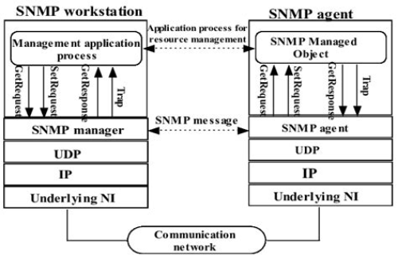

---

### Cheat sheet 

### SNMP Enumeration Commands

| Commands                                                                                                                                                             | Description                                           |
|----------------------------------------------------------------------------------------------------------------------------------------------------------------------|-------------------------------------------------------|
| `sudo nmap -sU -p161 --script=snmp-info <target>`                                                                              | Enumerate SNMP system info                           |
| `sudo nmap -sU -p161 --script=snmp-brute --script-args snmp-brute.communitiesdb=/path/to/list <target>`                        | Bruteforce SNMP community strings                    |
| `snmpwalk -v2c -c public <target>`                                                                                             | Walk full SNMP tree with community string `public`   |
| `snmpwalk -v1 -c public <target> system`                                                                                       | Query only the system OID subtree                    |
| `snmpget -v2c -c public <target> <OID>`                                                                                        | Query specific OID                                   |
| `snmpbulkwalk -v2c -c public <target>`                                                                                         | Faster, bulk SNMP walk                               |
| `onesixtyone -c /path/to/communities.txt <target>`                                                                             | Brute-force SNMP community strings                   |
| `snmp-check <target>`                                                                                                          | Quick SNMP audit: system info, users, services       |
| `snmpenum -t <target> -c public`                                                                                               | Older SNMP enumeration tool, still useful            |

### NSE Scripts

`find / -type f -name snmp* 2>/dev/null | grep scripts`

```/usr/share/nmap/scripts/snmp-info.nse  
/usr/share/nmap/scripts/snmp-brute.nse  
/usr/share/nmap/scripts/snmp-interfaces.nse  
/usr/share/nmap/scripts/snmp-netstat.nse  
/usr/share/nmap/scripts/snmp-processes.nse  
/usr/share/nmap/scripts/snmp-sysdescr.nse  
/usr/share/nmap/scripts/snmp-win32-services.nse  
/usr/share/nmap/scripts/snmp-win32-shares.nse  
/usr/share/nmap/scripts/snmp-win32-users.nse  
```

**SNMP (Simple Network Management Protocol)** is used for monitoring and managing network devices like routers, switches, servers, and printers.
It communicates using UDP port 161. Devices often expose sensitive data through SNMP if misconfigured.

• Version 1 & 2c: Use plaintext "community strings" (like passwords) → default: public, private<br>
• Version 3: Supports encryption/authentication (rarely configured properly)

