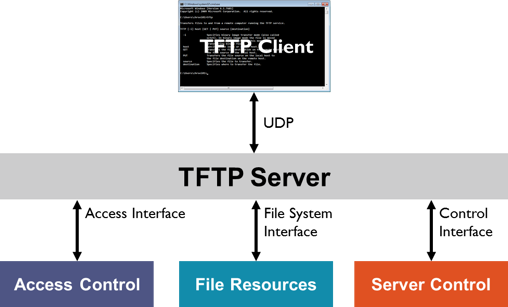

---

### Cheat sheet

| Command                                                                                  | Description                              |
|------------------------------------------------------------------------------------------|------------------------------------------|
| `sudo nmap -sU -p69 --script tftp-enum <target>`                                         | Enumerate TFTP (file listing if allowed) |
| `tftp <target>`                                                                          | Start TFTP interactive session           |
| `connect <target>`                                                                       | Inside TFTP client: connect to server    |
| `get <file>`                                                                             | Download file from TFTP server           |
| `put <file>`                                                                             | Upload file to TFTP server               |
| `verbose`                                                                                | Enable detailed output in TFTP session   |
| `mode binary`                                                                            | Ensure binary transfer mode              |
| `timeout <seconds>`                                                                      | Set timeout for transfers                |
| `quit`                                                                                   | Exit TFTP client                         |
| `atftp --get <file> --remote-file <file> <target>`                                       | Download with atftp tool                 |
| `atftp --put <file> --remote-file <file> <target>`                                       | Upload with atftp tool                   |
| `curl tftp://<target>/<file> --output <file>`                                            | Download file using curl                 |

### NSE Scripts

`find / -type f -name tftp* 2>/dev/null | grep scripts`

`/usr/share/nmap/scripts/tftp-enum.nse`

TFTP (Trivial File Transfer Protocol) is a simple, unauthenticated, UDP-based file transfer protocol. It's mainly used for bootstrapping devices (PXE boot), firmware 
upgrades, or lightweight config transfers.

• Runs over UDP/69 
• No authentication 
• No encryption 
• Read/write access may be unrestricted 
• Often found in embedded systems, printers, routers, VoIP setups 

