---

### Steps of how DNS works?

1. **Your Computer Asks for Directions (DNS Query)**: When you  enter the domain name, your computer first checks its memory (cache) to  see if it remembers the IP address from a previous visit. If not, it  reaches out to a DNS resolver, usually provided by your internet service  provider (ISP).

2. **The DNS Resolver Checks its Map (Recursive Lookup)**: The  resolver also has a cache, and if it doesn't find the IP address there,  it starts a journey through the DNS hierarchy. It begins by asking a  root name server, which is like the librarian of the internet.

3. **Root Name Server Points the Way**: The root server doesn't  know the exact address but knows who does – the Top-Level Domain (TLD)  name server responsible for the domain's ending (e.g., .com, .org). It  points the resolver in the right direction.

4. **TLD Name Server Narrows It Down**: The TLD name server is  like a regional map. It knows which authoritative name server is  responsible for the specific domain you're looking for (e.g., example.com) and sends the resolver there.

5. **Authoritative Name Server Delivers the Address**: The  authoritative name server is the final stop. It's like the street  address of the website you want. It holds the correct IP address and  sends it back to the resolver.

6. **The DNS Resolver Returns the Information**: The resolver  receives the IP address and gives it to your computer. It also remembers  it for a while (caches it), in case you want to revisit the website  soon.

7. **Your Computer Connects**: Now that your computer knows the  IP address, it can connect directly to the web server hosting the  website, and you can start browsing.

