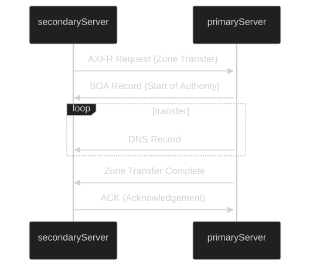

---

### Cheat sheet

| Commands                                                 | Description    |
|----------------------------------------------------------|----------------|
| `dig axfr @nsztm1.digi.ninja zonetransfer.me`              | Attempts a DNS Zone Transfer (AXFR) from the specified name server for the domain `zonetransfer.me`. |

A **DNS zone transfer** is essentially a wholesale copy of all DNS records within a zone (a domain and its subdomains) from one name server to another. 

This process is essential for maintaining consistency and redundancy across DNS servers. 

