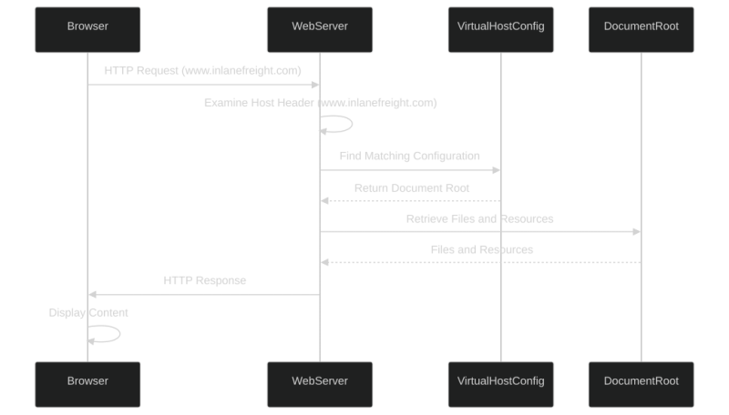

---

### Cheat sheet

| Commands                                                                                                         | Description          |
|------------------------------------------------------------------------------------------------------------------|----------------------|
| gobuster vhost -u http://<target_IP_address> -w <wordlist_file> --append-domain <domain>                        | Performs virtual host brute-forcing using the provided wordlist and appends each word to the specified domain. |

| Tool         | Description                                                                                  | Features                                                                |
|--------------|----------------------------------------------------------------------------------------------|-------------------------------------------------------------------------|
| gobuster     | Multi-purpose brute-forcing tool for directories, files, DNS, and virtual hosts.             | Fast, customizable, supports HTTP methods and multiple modules.        |
| feroxbuster  | Rust-based tool similar to Gobuster, optimized for speed and recursive scanning.             | Recursion, wildcard detection, filtering by status code and response.  |
| ffuf         | Flexible and fast web fuzzer, ideal for fuzzing parameters, paths, and headers.              | Fuzz Host header for VHost discovery, supports regex filtering, colors. |

