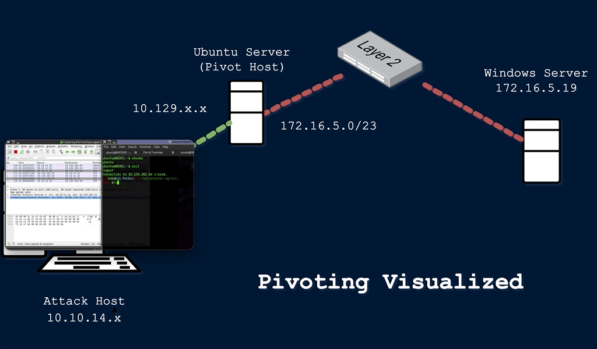

### Pivoting

Utilizing multiple hosts to cross `network` boundaries you would not usually have access to. This is more of a targeted objective. The goal here is to allow us to move deeper into a network by compromising targeted hosts or infrastructure.

```plaintext {filename="Example -"}
During one tricky engagement, the target had their network physically and logically separated. This separation made it difficult 
for us to move around and complete our objectives. We had to search the network and compromise a host that turned out to be the 
engineering workstation used to maintain and monitor equipment in the operational environment, submit reports, and perform other 
administrative duties in the enterprise environment. That host turned out to be dual-homed (having more than one physical NIC 
connected to different networks). Without it having access to both enterprise and operational networks, we would not have been 
able to pivot as we needed to complete our assessment. 
```

### Tunneling

We often find ourselves using various protocols to shuttle traffic in/out of a network where there is a chance of our traffic being detected. For example, using HTTP to mask our Command & Control traffic from a server we own to the victim host. The key here is obfuscation of our actions to avoid detection for as long as possible. We utilize protocols with enhanced security measures such as HTTPS over TLS or SSH over other transport protocols. These types of actions also enable tactics like the exfiltration of data out of a target network or the delivery of more payloads and instructions into the network.

```plaintext {filename="Example -"}
One way we used Tunneling was to craft our traffic to hide in HTTP and HTTPS. This is a common way we maintained Command and Control 
(C2) of the hosts we had compromised within a network. We masked our instructions inside GET and POST requests that appeared as 
normal traffic and, to the untrained eye, would look like a web request or response to any old website. If the packet were formed 
properly, it would be forwarded to our Control server. If it were not, it would be redirected to another website, potentially 
throwing off the defender checking it out.
```


