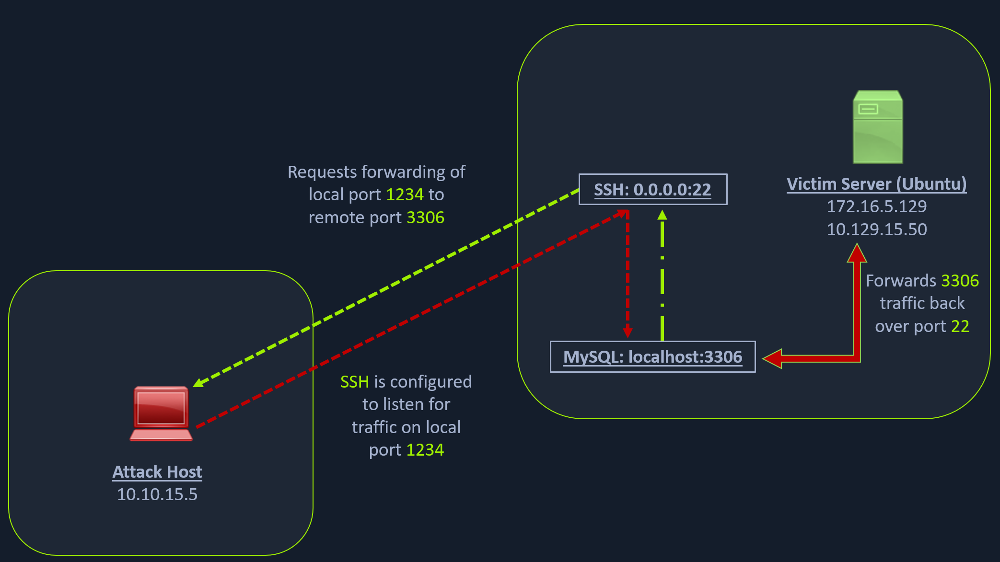

`Port forwarding` is a technique that allows us to redirect a communication request from one port to another. Port forwarding uses TCP as the primary communication layer to provide interactive communication for the forwarded port.

### SSH Local Port Forwarding



#### Scanning the Pivot Target

```bash
nmap -sT -p22,3306 <ip-address>
```

#### Executing the Local Port Forward

```bash
ssh -L 1234:localhost:3306 ubuntu@<ip-address>
```

#### Confirming Port Forward with Netstat

```bash
netstat -antp | grep 1234
```

#### Confirming Port Forward with Nmap

```bash
nmap -v -sV -p1234 localhost
```

#### Forwarding Multiple Ports

```bash
ssh -L 1234:localhost:3306 -L 8080:localhost:80 ubuntu@<ip-address>
```

### Setting up to Pivot


#### Enabling Dynamic Port Forwarding with SSH

```bash
ssh -D 9050 ubuntu@<ip-address>
```

Once the dynamic port forwarding is enabled using SSH, we will require a tool that can route any tool's packets over the port `9050`. We can do this using the tool `proxychains`, which is capable of redirecting TCP connections through TOR, SOCKS, and HTTP/HTTPS proxy servers and also allows us to chain multiple proxy servers together.

##### Checking /etc/proxychains.conf

```bash
tail -4 /etc/proxychains.conf

# meanwile
# defaults set to "tor"
socks4 	127.0.0.1 9050
```

##### Using Nmap with Proxychains

```bash
proxychains nmap -v -sn 172.16.5.1-200
```

**This part of packing all your Nmap data using proxychains and forwarding it to a remote server is called `SOCKS tunneling`**.

##### Using Metasploit with Proxychains

```bash
proxychains msfconsole
```

