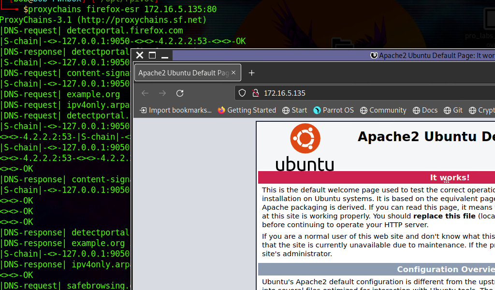

## Windows: plink.exe

[Plink](https://www.chiark.greenend.org.uk/~sgtatham/putty/latest.html), short for PuTTY Link, is a Windows command-line SSH tool that comes as a part of the PuTTY package when installed. Similar to SSH, Plink can also be used to create dynamic port forwards and SOCKS proxies.

### Getting To Know Plink


#### Using Plink.exe

```bash {filename= "Windows CMD"}}
plink -ssh -D 9050 ubuntu@10.129.15.50
```

## Windows: Proxifier

Another Windows-based tool called [Proxifier](https://www.proxifier.com/) can be used to start a SOCKS tunnel via the SSH session we created. Proxifier is a Windows tool that creates a tunneled network for desktop client applications and allows it to operate through a SOCKS or HTTPS proxy and allows for proxy chaining.


## Linux: Sshuttle

[Sshuttle](https://github.com/sshuttle/sshuttle) is another tool written in Python which removes the need to configure proxychains. However, this tool only works for pivoting over SSH and does not provide other options for pivoting over TOR or HTTPS proxy servers. `Sshuttle` can be extremely useful for automating the execution of iptables and adding pivot rules for the remote host. 

### Running sshuttle

To use sshuttle, we specify the option `-r` to connect to the remote machine with a username and password. Then we need to include the network or IP we want to route through the pivot host, in our case, is the network 172.16.5.0/23.

```bash
sudo sshuttle -r ubuntu@10.129.202.64 172.16.5.0/23 -v
```

With this command, sshuttle creates an entry in our `iptables` to redirect all traffic to the 172.16.5.0/23 network through the pivot host.

### Traffic Routing through iptables Routes

```bash
nmap -v -sV -p3389 172.16.5.19 -A -Pn
```

## Web Server Pivoting: Rpivot

[Rpivot](https://github.com/klsecservices/rpivot) is a reverse SOCKS proxy tool written in Python for SOCKS tunneling. Rpivot binds a machine inside a corporate network to an external server and exposes the client's local port on the server-side. 


### Cloning rpivot

```bash
git clone https://github.com/klsecservices/rpivot.git
```

### Installing Python2.7

```bash
sudo apt-get install python2.7
```

### Alternative Installation of Python2.7

```bash
curl https://pyenv.run | bash
echo 'export PYENV_ROOT="$HOME/.pyenv"' >> ~/.bashrc
echo 'command -v pyenv >/dev/null || export PATH="$PYENV_ROOT/bin:$PATH"' >> ~/.bashrc
echo 'eval "$(pyenv init -)"' >> ~/.bashrc
source ~/.bashrc
pyenv install 2.7
pyenv shell 2.7
```

### Transferring rpivot to the Target

```bash
scp -r rpivot ubuntu@<IpaddressOfTarget>:/home/ubuntu/
```

### Running server.py from the Attack Host

```bash
python2.7 client.py --server-ip 10.10.14.18 --server-port 9999
```

### Confirming Connection is Established

```bash
New connection from host 10.129.202.64, source port 35226
```

### Browsing to the Target Webserver using Proxychains

```bash
proxychains firefox-esr 172.16.5.135:80
```




```bash {filename="Note-"}
rpivot's server.py need to be run from Attack Host
rpivot's client.py need to be run from Pivot Host
```

### Connecting to a Web Server using HTTP-Proxy & NTLM Auth

```bash
python client.py --server-ip <IPaddressofTargetWebServer> --server-port 8080 --ntlm-proxy-ip <IPaddressofProxy> --ntlm-proxy-port 8081 --domain <nameofWindowsDomain> --username <username> --password <password>
```

## Port Forwarding with Windows: Netsh

[Netsh](https://docs.microsoft.com/en-us/windows-server/networking/technologies/netsh/netsh-contexts) is a Windows command-line tool that can help with the network configuration of a particular Windows system. Here are just some of the networking related tasks we can use `Netsh` for:

* `Finding routes`
* `Viewing the firewall configuration`
* `Adding proxies`
* `Creating port forwarding rules`


We can use `netsh.exe` to forward all data received on a specific port (say 8080) to a remote host on a remote port. This can be performed using the below command.

### Using Netsh.exe to Port Forward

```bash
C:\Windows\system32> netsh.exe interface portproxy add v4tov4 listenport=8080 listenaddress=10.129.15.150 connectport=3389 connectaddress=172.16.5.25
```

### Verifying Port Forward

```bash
C:\Windows\system32> netsh.exe interface portproxy show v4tov4

Listen on ipv4:             Connect to ipv4:

Address         Port        Address         Port
--------------- ----------  --------------- ----------
10.129.15.150   8080        172.16.5.25     3389
```

### Connecting to the Internal Host through the Port Forward


