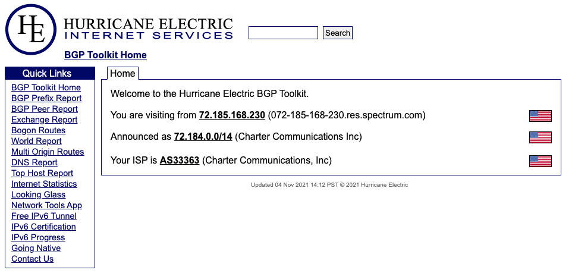
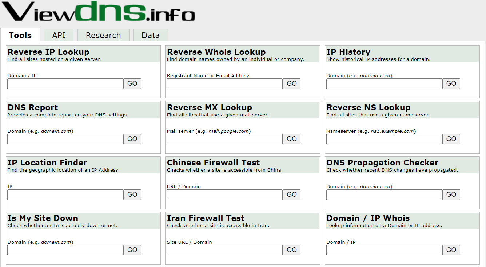
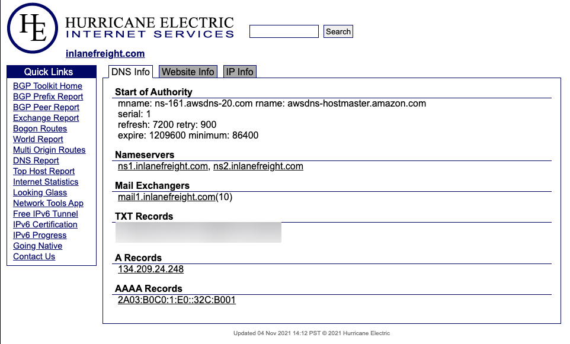
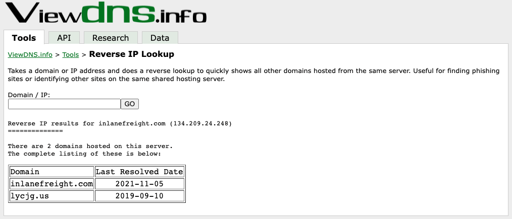
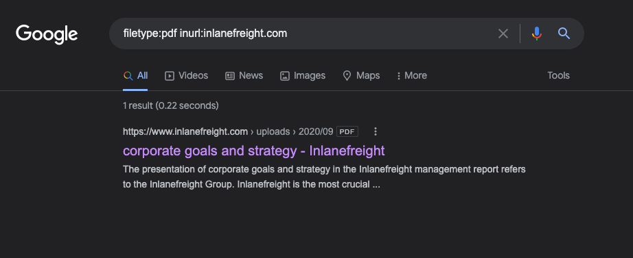
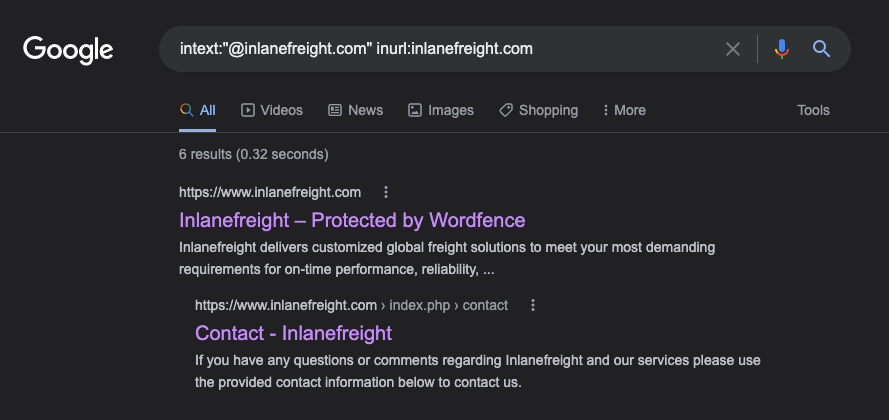
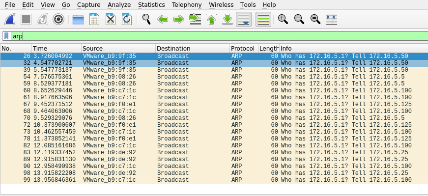
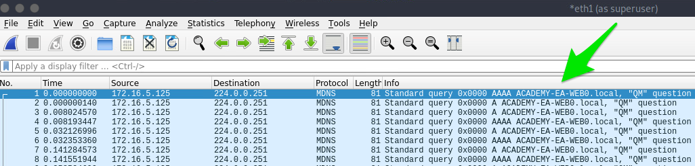

---

## External Recon and Enumeration Principles

### What Are We Looking?

| **Data Point** | **Description** |
|----------------|-----------------|
| **IP Space** | ASN and netblocks owned/used by the target, public-facing IP ranges, cloud providers and hosting, DNS records, and related infrastructure. |
| **Domain Information** | Domain ownership and admin details, subdomains, public-facing services (mail, DNS, websites, VPN), and observable defenses (SIEM, AV, IDS/IPS). |
| **Schema Format** | Information that reveals email formats, AD username patterns, password policy hints — useful for building valid username lists for spraying/credential-stuffing. |
| **Data Disclosures** | Publicly accessible documents (PDF, PPT, DOCX, XLSX, repos) that expose internal sites, user metadata, shares, or credentials (e.g., PDF metadata, exposed GitHub secrets). |
| **Breach Data** | Any leaked or published usernames, passwords, or other credentials and sensitive data that could be reused to gain access. |

### Where Are We Looking?

| **Resource** | **Examples / Notes** |
|--------------|----------------------|
| ASN / IP registrars | [IANA](https://www.iana.org/), [ARIN](https://www.arin.net/) (Americas), [RIPE](https://www.ripe.net/) (Europe), [BGP Toolkit](https://bgp.he.net/) — lookup netblocks and origin ASNs. |
| Domain Registrars & DNS | [DomainTools](https://www.domaintools.com/), [PTRArchive](http://ptrarchive.com/), [ICANN](https://lookup.icann.org/lookup) WHOIS, DNS queries (e.g., against 8.8.8.8) — registrar and record history. |
| Social Media | LinkedIn, X (Twitter), Facebook, regional platforms, news sites — people, org structure, tooling hints. |
| Public-Facing Company Websites | Corporate site — press, careers, contact pages, embedded docs (PDFs, whitepapers). |
| Cloud & Dev Storage | [GitHub](https://github.com/), [public S3/Azure/Google storage](https://grayhatwarfare.com/), [code search (Google dorks)](https://www.exploit-db.com/google-hacking-database) — leaked configs, keys, repos. |
| Breach Data Sources | [HaveIBeenPwned](https://haveibeenpwned.com/), [Dehashed](https://www.dehashed.com/) — leaked emails, passwords, or hashes for reuse or cracking. |

#### Finding Address Spaces



The [BGP-Toolkit](https://bgp.he.net/) hosted by `Hurricane Electric` is a fantastic resource for researching what address blocks are assigned to an organization and what ASN they reside within. 

#### DNS 

DNS is a great way to validate our scope and find out about reachable hosts the customer did not disclose in their scoping document. Sites like [domaintools](https://whois.domaintools.com/), and [viewdns.info](https://viewdns.info/) are great spots to start.

##### Viewdns.info



#### Public Data

Social media can be a treasure trove of interesting data that can clue us in to how the organization is structured, what kind of equipment they operate, potential software and security implementations, their schema, and more. On top of that list are job-related sites like LinkedIn, Indeed.com, and Glassdoor. 

##### Sharepoint Admin Job Listing


Tools like [Trufflehog](https://github.com/trufflesecurity/truffleHog) and sites like [Greyhat Warfare](https://buckets.grayhatwarfare.com/) are fantastic resources for finding these breadcrumbs.

#### Example Enumeration Process

##### Check for ASN/IP & Domain Data



##### Viewdns Results



```bash
samzz@htb[/htb]$ nslookup ns1.inlanefreight.com

Server:		192.168.186.1
Address:	192.168.186.1#53

Non-authoritative answer:
Name:	ns1.inlanefreight.com
Address: 178.128.39.165

nslookup ns2.inlanefreight.com
Server:		192.168.86.1
Address:	192.168.86.1#53

Non-authoritative answer:
Name:	ns2.inlanefreight.com
Address: 206.189.119.186 
```

##### Hunting For Files



##### Hunting E-mail Addresses



##### E-mail Dork Results

Browsing the contact page, we can see several emails for staff in different offices around the globe.


##### Username Harvesting

We can use a tool such as [linkedin2username](https://github.com/initstring/linkedin2username) to scrape data from a company's LinkedIn page and create various mashups of usernames (flast, first.last, f.last, etc.) that can be added to our list of potential password spraying targets.

##### Credential Hunting

[Dehashed](http://dehashed.com/) is an excellent tool for hunting for cleartext credentials and password hashes in breach data. 

```bash
samzz@htb[/htb]$ sudo python3 dehashed.py -q inlanefreight.local -p

id : 5996447501
email : roger.grimes@inlanefreight.local
username : rgrimes
password : Ilovefishing!
hashed_password : 
name : Roger Grimes
vin : 
address : 
phone : 
database_name : ModBSolutions

id : 7344467234
email : jane.yu@inlanefreight.local
username : jyu
password : Starlight1982_!
hashed_password : 
name : Jane Yu
vin : 
address : 
phone : 
database_name : MyFitnessPal

<SNIP>
```

[Here](https://github.com/sm00v/Dehashed) you can found the script used above.

### Initial Enumeration of the Domain

#### TTPs

Here’s the same TTPs condensed into one clear paragraph:

Plan the work, then start quietly—collect public info like IPs, domains, and leaked files—before you touch the target. Next, validate what’s alive (which hosts and services respond), then probe those hosts to pull useful directory details. Stop, sort what you found, and pick the best targets to focus on; if you get credentials, use them to dig deeper and confirm attack paths. Repeat the cycle, document commands and findings, and keep the scope tight.

#### Identifying Hosts

First, let's take some time to listen to the network and see what's going on. We can use `Wireshark` and `TCPDump` to "put our ear to the wire" and see what hosts and types of network traffic we can capture. 

This is particularly helpful if the assessment approach is "black box." We notice some [ARP](https://en.wikipedia.org/wiki/Address_Resolution_Protocol) requests and replies, [MDNS](https://en.wikipedia.org/wiki/Multicast_DNS), and other basic [layer two](https://www.juniper.net/documentation/us/en/software/junos/multicast-l2/topics/topic-map/layer-2-understanding.html) packets.

##### Start Wireshark on ea-attack01

```bash
sudo -E wireshark

11:28:20.487     Main Warn QStandardPaths: runtime directory '/run/user/1001' is not owned by UID 0, but a directory permissions 0700 owned by UID 1001 GID 1002
<SNIP>
```

###### Wireshark Output



ARP packets make us aware of the hosts: 172.16.5.5, 172.16.5.25 172.16.5.50, 172.16.5.100, and 172.16.5.125.



MDNS makes us aware of the ACADEMY-EA-WEB01 host.

If we are on a host without a GUI (which is typical), we can use [tcpdump](https://linux.die.net/man/8/tcpdump), [net-creds](https://github.com/DanMcInerney/net-creds), and [NetMiner](https://www.netminer.com/en/product/netminer.php), etc., to perform the same functions. 

##### Tcpdump Output

```bash
samzz@htb[/htb]$ sudo tcpdump -i ens224 
```


Our first look at network traffic pointed us to a couple of hosts via MDNS and ARP. Now let's utilize a tool called Responder to analyze network traffic and determine if anything else in the domain pops up.

##### Responder

[Responder](https://github.com/lgandx/Responder-Windows) is a tool built to listen, analyze, and poison `LLMNR`, `NBT-NS`, and `MDNS` requests and responses. It has many more functions, but for now, all we are utilizing is the tool in its Analyze mode. This will passively listen to the network and not send any poisoned packets. 

```bash
sudo responder -I ens224 -A 
```

###### Responder Results


Now let's perform some active checks starting with a quick ICMP sweep of the subnet using fping.

##### Fping

[Fping](https://fping.org/) provides us with a similar capability as the standard ping application in that it utilizes ICMP requests and replies to reach out and interact with a host. Where fping shines is in its ability to issue ICMP packets against a list of multiple hosts at once and its scriptability. 

###### FPing Active Checks

```bash
samzz@htb[/htb]$ fping -asgq 172.16.5.0/23

172.16.5.5
172.16.5.25
172.16.5.50
172.16.5.100
172.16.5.125
172.16.5.200
172.16.5.225
172.16.5.238
172.16.5.240
```

##### Nmap Scanning

```bash
sudo nmap -v -A -iL hosts.txt -oN filename
```

##### Kerbrute - Internal AD Username Enumeration

[Kerbrute](https://github.com/ropnop/kerbrute) can be a stealthier option for domain account enumeration. It takes advantage of the fact that Kerberos pre-authentication failures often will not trigger logs or alerts. We will use Kerbrute in conjunction with the `jsmith.txt` or `jsmith2.txt` user lists from [Insidetrust](https://github.com/insidetrust/statistically-likely-usernames). This repository contains many different user lists that can be extremely useful when attempting to enumerate users when starting from an unauthenticated perspective.

To get started with Kerbrute, we can download [precompiled binaries](https://github.com/ropnop/kerbrute/releases/latest) for the tool for testing from Linux, Windows, and Mac, or we can compile it ourselves. 

###### Enumerating Users with Kerbrute

```bash
samzz@htb[/htb]$ kerbrute userenum -d INLANEFREIGHT.LOCAL --dc 172.16.5.5 jsmith.txt -o valid_ad_users

2021/11/17 23:01:46 >  Using KDC(s):
2021/11/17 23:01:46 >   172.16.5.5:88
2021/11/17 23:01:46 >  [+] VALID USERNAME:       jjones@INLANEFREIGHT.LOCAL
2021/11/17 23:01:46 >  [+] VALID USERNAME:       sbrown@INLANEFREIGHT.LOCAL
2021/11/17 23:01:46 >  [+] VALID USERNAME:       tjohnson@INLANEFREIGHT.LOCAL
2021/11/17 23:01:50 >  [+] VALID USERNAME:       evalentin@INLANEFREIGHT.LOCAL

 <SNIP>
 
2021/11/17 23:01:51 >  [+] VALID USERNAME:       sgage@INLANEFREIGHT.LOCAL
2021/11/17 23:01:51 >  [+] VALID USERNAME:       jshay@INLANEFREIGHT.LOCAL
2021/11/17 23:01:51 >  [+] VALID USERNAME:       jhermann@INLANEFREIGHT.LOCAL
2021/11/17 23:01:51 >  [+] VALID USERNAME:       whouse@INLANEFREIGHT.LOCAL
2021/11/17 23:01:51 >  [+] VALID USERNAME:       emercer@INLANEFREIGHT.LOCAL
2021/11/17 23:01:52 >  [+] VALID USERNAME:       wshepherd@INLANEFREIGHT.LOCAL
2021/11/17 23:01:56 >  Done! Tested 48705 usernames (56 valid) in 9.940 seconds
```