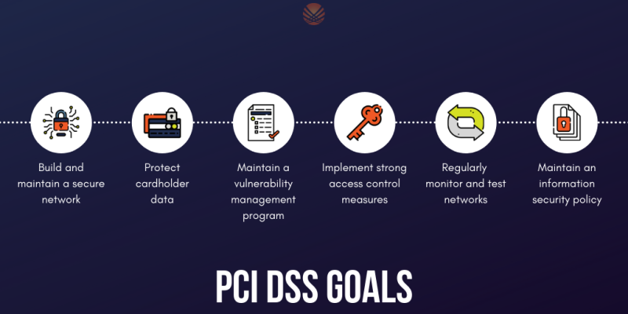

---

### PCI DSS 

### Health Insurance Portability and Accountability Act (HIPAA)

HIPAA is the **Health Insurance Portability and Accountability Act**, which is used to protect patients' data. HIPAA does not necessarily require vulnerability scans or assessments; however, a risk assessment and vulnerability identification are required to maintain HIPAA accreditation.

### Federal Information Security Management Act (FISMA)

The **Federal Information Security Management Act (FISMA)** is a set of standards and guidelines used to safeguard government operations and information. The act requires an organization to provide documentation and proof of a vulnerability management program to maintain information technology systems' proper availability, confidentiality, and integrity.

### ISO 27001

**ISO 27001** is a standard used worldwide to manage information security. ISO 27001 requires organizations to perform quarterly external and internal scans.

### Penetration Testing Standards

The **Penetration Testing Execution Standard (PTES)** can be applied to all types of penetration tests. It outlines the  phases of a penetration test and how they should be conducted. These are  the sections in the PTES:

• Pre-engagement Interactions 
• Intelligence Gathering 
• Threat Modeling 
• Vulnerability Analysis 
• Exploitation 
• Post Exploitation 
• Reporting 

### OSSTMM

OSSTMM is the **Open Source Security Testing Methodology Manual**,  another set of guidelines pentesters can use to ensure they're doing  their jobs properly. It can be used alongside other pentest standards.

OSSTMM is divided into five different channels for five different areas of pentesting:

1. Human Security (human beings are subject to social engineering exploits) 
2. Physical Security 
3. Wireless Communications (including but not limited to technologies like WiFi and Bluetooth) 
4. Telecommunications 
5. Data Networks 

### NIST

The NIST (**National Institute of Standards and Technology**) is well known for their NIST Cybersecurity Framework,  a system for designing incident response policies and procedures. NIST  also has a Penetration Testing Framework. The phases of the NIST  framework include:

• Planning 
• Discovery 
• Attack 
• Reporting 

