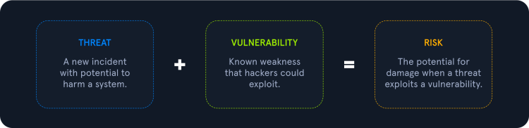
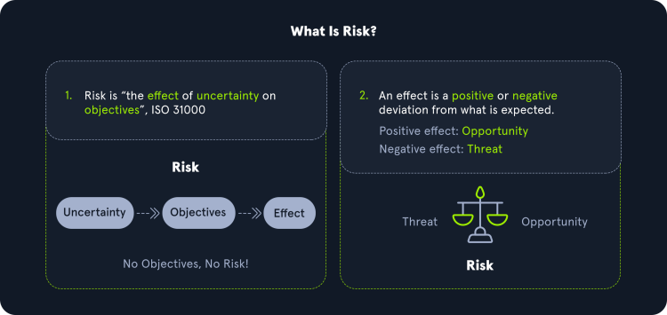
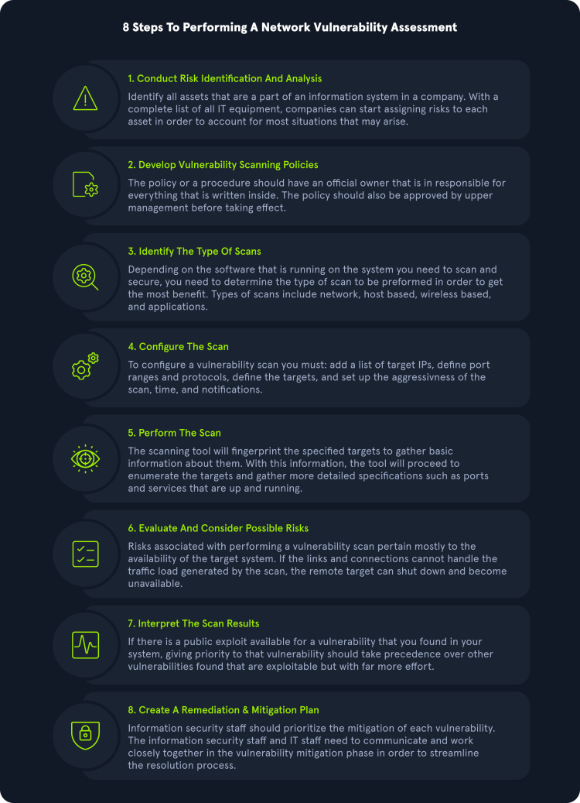
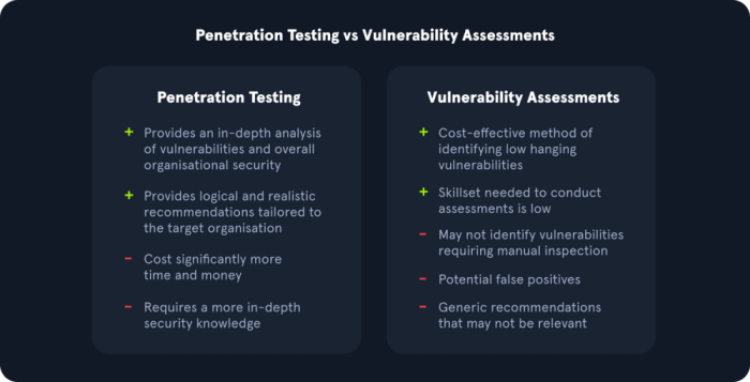
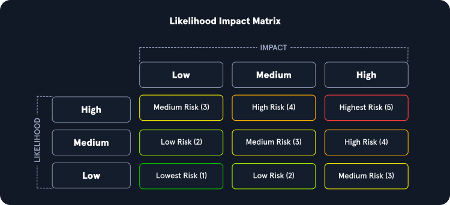

---

A **Vulnerability Assessment** aims to identify and categorize risks for security weaknesses related to assets within an environment. It is important to note that there is little to no manual exploitation during a vulnerability assessment. A vulnerability assessment also provides remediation steps to fix the issues.

The purpose of a Vulnerability Assessment is to understand, identify, and categorize the risk.

### Vulnerability

A Vulnerability is a weakness or bug in an organization's environment, including applications, networks, and infrastructure, that opens up the possibility of threats from external actors. 

### Threat

A Threat is a process that amplifies the potential of an adverse event, such as a threat actor exploiting a vulnerability. 

### Risks 

Risk is the possibility of assets or data being harmed or destroyed by threat actors.

