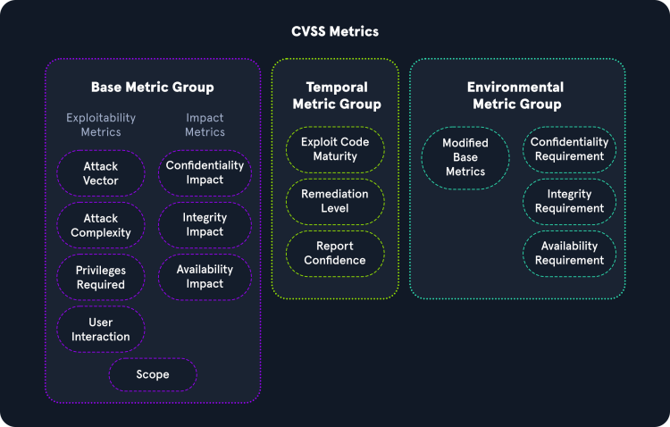
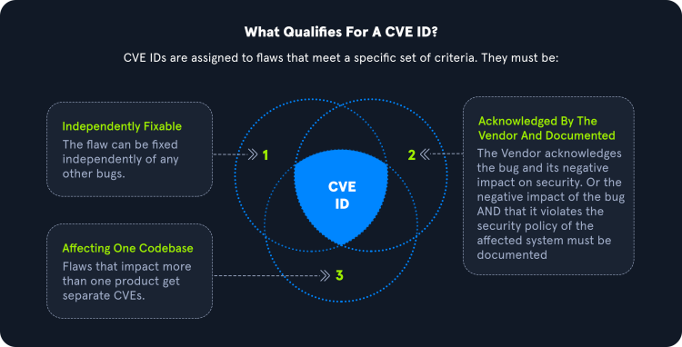

---

### Common Vulnerability Scoring System (CVSS)

The [**Common Vulnerability Scoring System (CVSS)**](https://www.first.org/cvss/) is an industry standard for performing these calculations.
 
The CVSS is often used together with the so-called Microsoft DREAD. DREAD is a risk assessment system developed by Microsoft to help IT security professionals evaluate the severity of security threats and vulnerabilities.

### Common Vulnerabilities and Exposures (CVE)

**Common Vulnerabilities and Exposures (CVE)** is a publicly available catalog of security issues sponsored by the United States Department of Homeland Security (DHS). Each security issue has a unique CVE ID number assigned by the CVE Numbering Authority (CNA). The purpose of creating a unique CVE ID number is to create a standardization for a vulnerability or exposure as a researcher identifies it. 

